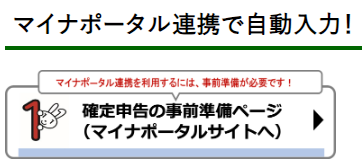

https://kijuky.hatenablog.com/entry/2024/01/28/000635

---

不妊治療をしていると医療費が高くなるので確定申告するのがセオリー。ということで確定申告を準備していたら、マイナポータルがメガシンカしていたので、ちょっと記録したくなった。

### マイナポータル連携で自動入力！

確定申告するとなると、医療費だけではなく、ふるさと納税やら証券取引の何やらもちゃんと計算しなくてはならない。医療費だけでいいのに、しんどい。そんな中、マイナポータルに新しい機能がリリースされた。

  
[マイナポータル連携で自動入力！｜令和5年分 確定申告特集](https://www.nta.go.jp/taxes/shiraberu/shinkoku/tokushu/mynaportal-jidou/)

これはマイナポータル上で証券会社等のサービスを連携させることで、それらのサービスの控除の数値を自動で確定申告の情報に自動入力できるというサービスだ。確定申告の申告内容について不備があれば脱税になってしまう可能性があるので、連携したサービスで自動で入力してくれるのはとても助かる話である。

ただし、マイナポータル自体がその機能を有している訳ではなく、[e-私書箱](https://www.nta.go.jp/taxes/shiraberu/shinkoku/tokushu/mynaportal-jidou/)というサービスを介して、証券会社や保険会社と連携することになる。なお、下記リンクからe-私書箱の新規登録はしなくて良い。マイナポータル上でe-私書箱の新規登録もしてくれる。この辺はスムーズに登録できて便利だと思う。

https://www.nta.go.jp/taxes/shiraberu/shinkoku/tokushu/mynaportal-jidou/

e-私書箱から、各証券会社、保険会社と連携設定を行うのだが、これが結構厄介だった。結論を言えば連携設定はNFC機能付きスマホで行うと良い。PCで連携設定を行うと、ログイン時にマイナンバーカードを読み取るためにカードリーダーを要求されてとても面倒くさい。カードリーダーも安いやつはマイナンバーカードAPの相性が悪かったりするので、ちゃんとしたものを買おうとすれば3,000~5,000円くらいかかる。今時のスマホはほとんどNFC機能がついているので、ログイン時に困ったらスマホにURLを送ってスマホで続きの手続きを進めると良い。ログイン情報がリセットされるところだけ注意だ。

あと、連携をする上で署名用電子証明書パスワードを要求されることがあった。これはマイナンバーカードを発行する際に設定する、英数字６文字以上のパスワードだ。私はこれを幾度となく忘れてその度に市役所に再設定しに行っていた。ところが、今ではこれはコンビニやマイナポータルアプリで再設定できるようになっていた。コンビニで再設定する場合はリセット用アプリを用意する必要があるので、マイナポータルアプリでやったほうが便利だ。

ちなみに、連携したサービスの情報はすぐに確認できるものもあれば、数日かかるものもあるらしい。私が愛用している楽天証券は２月以降じゃないと連携できないらしい。

...さて、本来したかった医療費控除は一切できずに、サービス連携しまくって満足しちゃったんだけど、私は確定申告できるのだろうか、それだけが心配だ。

ところで、記事のタイトルはAI機能があるということで使ってみたが、どうなんだろうか。話題がまとまっていない記事につけるタイトルは難しいように思える。