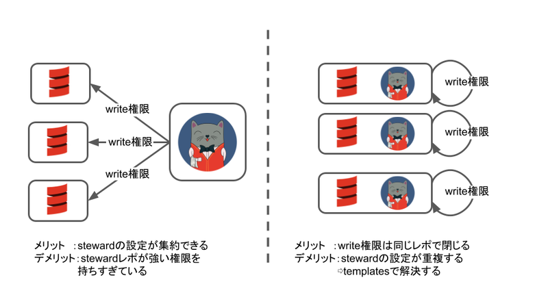
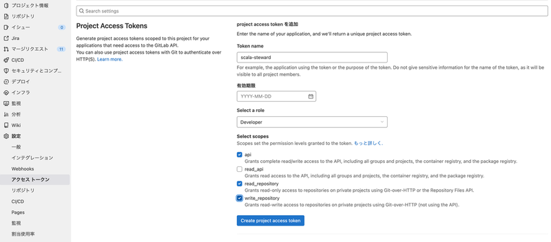
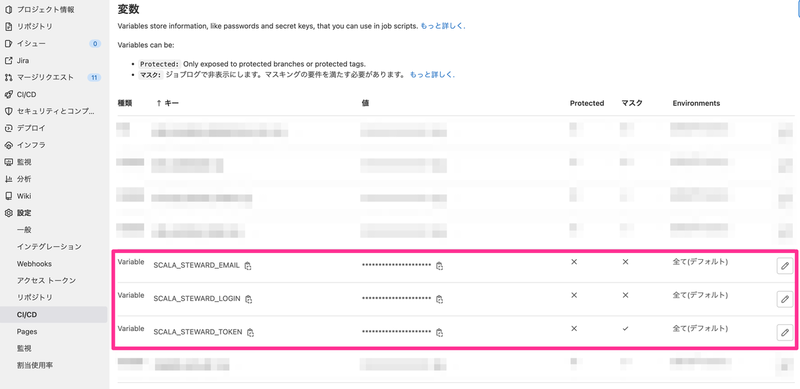
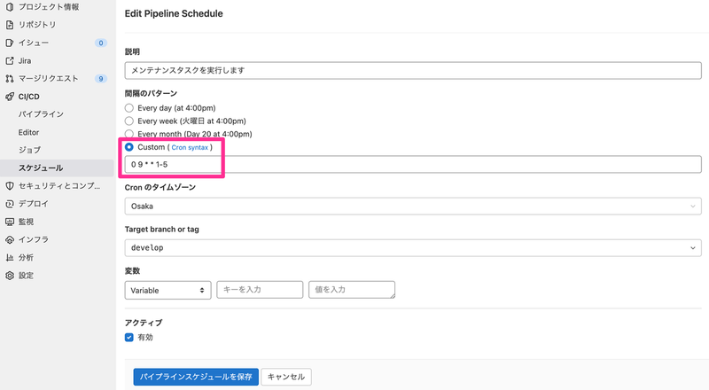

https://www.m3tech.blog/entry/2022/06/13/142100

---

エムスリーエンジニアリンググループでまどマギのマミさんが好きな安江です。今回はScalaプロダクトにScala Stewardを導入したのでご紹介します。

# 依存ライブラリのバージョンアップの辛い思い出

最近、Log4ShellやSpring4Shellなどの脆弱性対応により、依存ライブラリの緊急アップデートをする必要がありました。とくにこれらのライブラリは多くのプロダクトで利用されていたため、あまり改修がないプロダクトも緊急アップデートの対象になりました。これらのプロダクトをアップデートする際、対象のライブラリのアップデート以外にも、それに依存する別ライブラリのバージョンを上げる必要もありました。ライブラリのバージョンアップによってインタフェースが変わって、既存コードの修正が必要な場面もありました。プロダクトのコードが変わると、QA工程もある程度積んだ方が良いですよね。しかしながらこれは緊急アップデートです。早急に対応したいのに工数が増えることは困ります。

…なぜこんなことになったのでしょう？　それは依存ライブラリを一気にバージョンアップしようとしたためです。「数年分のアップデートを一気におこなう」と聞けば、それは大規模な作業になりそうだと思うでしょう。では「数日分のアップデートをおこなう」と聞けばどうでしょうか？日々の依存ライブラリのバージョンアップを支援するツールがScala Stewardになります。

# Scala Stewardを導入

[https://github.com/scala-steward-org/scala-steward:embed:cite]

Scala Stewardは、そのリポジトリ内の`repo.md`に書かれたリポジトリを巡回し、そこで使われている依存ライブラリが古かった場合に、対象のリポジトリにマージリクエスト（プルリクエスト）を作成します。このため、Scala Stewardリポジトリは各リポジトリに対してwrite権限などの強力な権限を要求します。弊社のセキュリティ基準では「不必要に権限を持ち過ぎている」ということで却下されました。そのため、リポジトリ毎にScala Stewardの設定を追加することにしました。



各リポジトリに同じような設定を追加することになるため、GitLab CIのテンプレート機能を使って省力化しました。GitLab CIのテンプレート機能についてはこちらの記事が詳しいです。

[https://www.m3tech.blog/entry/gitlab-include:embed:cite]

```yaml
.scala-steward:
  rules:
    - if: '$CI_PIPELINE_SOURCE == "schedule"'
  image:
    name: fthomas/scala-steward:latest
    entrypoint: [""]
  script:
    - echo "- $CI_PROJECT_PATH" > repos.md
    - echo -e '#!/usr/bin/env bash\necho "${SCALA_STEWARD_TOKEN}"' > askpass.sh
    - chmod +x askpass.sh
    - mkdir --parents "$CI_PROJECT_DIR/.sbt" "$CI_PROJECT_DIR/.ivy2"
    - ln -sfT "$CI_PROJECT_DIR/.sbt"  "$HOME/.sbt"
    - ln -sfT "$CI_PROJECT_DIR/.ivy2" "$HOME/.ivy2"
    - /opt/docker/bin/scala-steward
      --workspace "$CI_PROJECT_DIR/workspace"
      --process-timeout 30min
      --do-not-fork
      --repos-file "$CI_PROJECT_DIR/repos.md"
      --repo-config "$CI_PROJECT_DIR/.scala-steward.conf"
      --git-author-email "${SCALA_STEWARD_EMAIL}"
      --vcs-type "gitlab"
      --vcs-api-host "${CI_API_V4_URL}"
      --vcs-login "${SCALA_STEWARD_LOGIN}"
      --git-ask-pass "$CI_PROJECT_DIR/askpass.sh"
  cache:
    key: scala-steward
    paths:
      - .ivy2/cache
      - .sbt/boot/scala*
      - workspace/store
```

[Scala Stewardで用意されているもの](https://github.com/scala-steward-org/scala-steward/blob/main/docs/running.md#gitlab)との違いは、`repos.md`には自身のリポジトリしか登録しないようにしていることと、CI内部で`askpass.sh`を作っていることです。これにより、次に示す導入先リポジトリでの記述を少なくしています。

導入先リポジトリの`.gitlab-ci.yml`はこんな感じです。

```yaml
include:
  - project: m3/ci-templates
    ref: main
    file: scala-steward/scala-steward.yml

scala-steward:
  extends: .scala-steward
```

下記スクリーンショットを参考にプロジェクトアクセストークンを用意します。作ったアクセストークンは後に示す環境変数 `SCALA_STEWARD_TOKEN` の値として設定します。



環境変数として`SCALA_STEWARD_TOKEN`, `SCALA_STEWARD_EMAIL`, `SCALA_STEWARD_LOGIN`を用意します。`SCALA_STEWARD_EMAIL` や `SCALA_STEWARD_LOGIN` は git の commit のアカウント情報などで使われますので、それっぽい値を設定しておきます。



これを月~金の毎朝9時に実行するようにスケジュールを作成します。



これで、毎日依存ライブラリの更新を自動でチェックする体制ができました。緊急アップデートがあっても対象のライブラリ以外はすべて最新であることが保証されます。やったね！

# その他の運用

Playプロダクトの場合、とくにJackson周りの依存関係で、特定のライブラリに関してはバージョンアップの検知を無視したいことがあります。そのような場合には`.scala-steward.conf`にてignore設定を追加します（書き方が分からなかったので[Playの.scala-steward.conf](https://github.com/playframework/playframework/blob/main/.scala-steward.conf)を参考にしました）。

```
updates.ignore = [
  # 依存先の parser-combinators が、play とバッティングするため。
  { groupId = "org.scalatra.scalate", artifactId = "scalate-core" },
  # 依存先にある jackson databind が、play json とバッティングするため。
  { groupId = "javax.servlet", artifactId = "javax.servlet-api" }
]
```

今回導入したリポジトリでは、週1回の定期リリースが設けられていたため、Scala Stewardが作成したマージリクエストのマージ判定は、その週のリリース担当者に任せました。その際、変更の難易度に応じて下記のように対応してもらうようにしました。まだ始めたばかりなので、やっていく中で変えていくかもしれません。

- scalafmtや、テストで使用するライブラリのバージョンアップの場合は自動テストが通ったらマージ可能
- IFの変更でコードの変更があったり、プロダクトで使用するライブラリのバージョンアップの場合はQA工程を実施すればマージ可能
- scala/sbt/playなどのバージョンバップの場合は、チームミーティングで共有＆バージョンアップのスケジュールを立てる

# We're hiring !!!

エムスリーでは、普段からライブラリの更新を怠らないくらいマメな方もそうじゃない方も募集しています。ちょっとでも気になったら下記をご確認ください。

https://jobs.m3.com/product/
