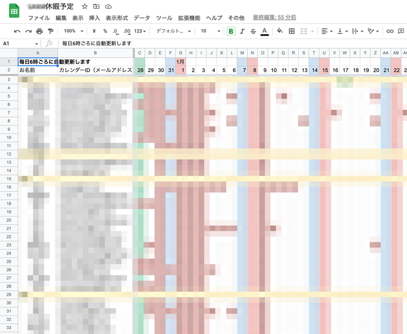
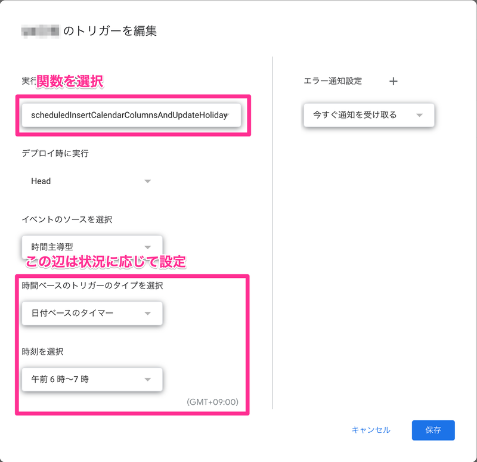
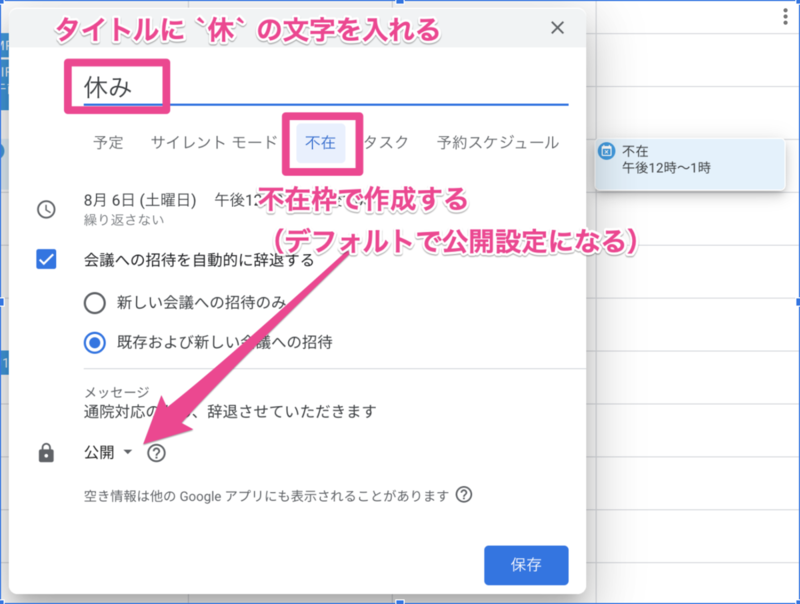

https://www.m3tech.blog/entry/2022/12/29/180000

---

これはエムスリー Advent Calendar 2022の29日目の記事です。 前日は [@a___iwata](https://twitter.com/a___iwata) による、[PdM4年目が読んで良かった本5選](https://www.m3tech.blog/entry/2022/12/28/180000)でした。

エムスリーエンジニアリンググループでScalaとマミさんが好きな安江です。年末年始、皆さんはいかがお過ごしでしょうか？　さて、長期休暇の時期が迫ってくると、どのメンバーがいつ休暇を取るのか把握するため、チームリーダーから休暇予定スプレッドシートが配られることはありませんか？私はありました。さらに、チームを兼務していたりすると複数の（場合によっては異なるフォーマットの）スプレッドシートに休暇予定を入力する必要がありました。面倒ですね。トイルですね。では、撲滅しましょう。そうしましょう。

# はじめに

- あなたの会社ではGoogle Workspaceで管理されているものとします。
- 個人のカレンダーはGoogleカレンダーで管理されているものとします。
- 長期休暇を含む、普段の休暇予定もGoogleカレンダーに設定しているものとします。
- （課題）チームメンバーの休暇予定一覧がわからないもしくは把握しづらいものとします。
- （解決方法）スプレッドシートにチームメンバーの休暇予定の一覧をまとめるようにします。

# 解決方法

今回はこちらのスプレッドシートを参照してもらうことにします。実際に使う場合はこのスプレッドシートをコピーして使います。コピーすると、紐づくGASも一緒にコピーされます。

  
実際に運用している休暇予定シート

[https://docs.google.com/spreadsheets/d/1Mjvm0KGu8vbMHDRGUtrsVhhAl9CrPWGpSnL1mb7fi-o/edit#gid=0:title]

※Googleアカウントでアクセスすると「コピーを作成」でコピーできます。

次の節でスプレッドシートとGASの説明をします。

## スプレッドシート

- A列には名前を入力します。これはGASでは使われません。
- B列にはカレンダーIDを入力します。個人のカレンダーIDはメールアドレスになるので、基本的にはメールアドレスを入力します。個人に紐づかないカレンダーIDを入れても良いです。
- C列以降が具体的な休暇予定になります。
    - 休暇予定が入っている日に`休`と入力されます。ここでは`休`という文字を含む予定がある場合、その日は休暇予定が入っているとします。
    - GASを実行することで自動的に列が挿入されます。ここでは60日分の列が挿入されます。

## GAS

```javascript
function scheduledInsertCalendarColumnsAndUpdateHoliday() {
  insertCalendarColumns();
  updateHoliday();
}

function insertCalendarColumns() {
  const spreadsheet = SpreadsheetApp.getActive();
  const sheet = spreadsheet.getSheetByName("休暇予定");

  // 日付を設定
  const now = new Date();
  sheet.getRange(2, 3).setValue(new Date(now.getFullYear(), now.getMonth(), now.getDate()));
  sheet.getRange(2, 4).setValue(new Date(now.getFullYear(), now.getMonth(), now.getDate() + 1));
  sheet.getRange(3, 3, sheet.getMaxRows() - 2, 2).setValue("");

  // 今日から60日後までのセルを追加
  const numDeleteColumns = sheet.getMaxColumns() - 4;
  if (numDeleteColumns > 0) {
    sheet.deleteColumns(5, numDeleteColumns);
  }
  sheet.insertColumnsAfter(4, 60);
  const sourceRange = sheet.getRange(1, 3, sheet.getMaxRows(), 2);
  const insertRange = sheet.getRange(1, 3, sheet.getMaxRows(), sheet.getMaxColumns() - 2);
  sourceRange.autoFill(insertRange, SpreadsheetApp.AutoFillSeries.DEFAULT_SERIES);
}

// Googleカレンダーから休暇予定を同期する
function updateHoliday() { 
  const spreadsheet = SpreadsheetApp.getActive();
  const sheet = spreadsheet.getSheetByName("休暇予定");
  const range = sheet.getRange(2, 1, sheet.getMaxRows() - 1, sheet.getMaxColumns());
  const values = range.getValues();

  const numRows = range.getNumRows();
  const numColumns = range.getNumColumns();
  const startTime = values[0][2];
  const endTime = values[0][numColumns - 1];
  const japaneseholidayCalendar = CalendarApp.getCalendarById("ja.japanese#holiday@group.v.calendar.google.com");
  const japaneseHolidayEvents = japaneseholidayCalendar.getEvents(startTime, endTime).map(toLightEvent_);
  for (let i = 1; i < numRows; i++) {
    const calendarId = values[i][1];
    if (calendarId == "") {
      continue;
    }

    let calendar = CalendarApp.getCalendarById(calendarId);
    if (calendar == null) {
      try {
        calendar = CalendarApp.subscribeToCalendar(calendarId);
      } catch (e) {
        console.error(`${calendarId}を取得できませんでした。`);
        calendar = {getEvents: () => []};
      }
    }

    const events = calendar.getEvents(startTime, endTime).map(toLightEvent_);
    for (let j = 2; j < numColumns; j++) {
      const date = values[0][j];
      if (isOwnHoliday_(date)) {
        values[i][j] = "休";
      } else if (filterDateEvents_(date, japaneseHolidayEvents).length) {
        values[i][j] = "祝";
      } else {
        const texts = filterDateEvents_(date, events).map(toHolidayText_).filter(text => text);
        if (texts.length) {
          values[i][j] = texts[0];
        }
      }
    }
  }

  range.setValues(values);
}

// そのグループ独自の休日であれば true
function isOwnHoliday_(date) {
  return false;
}

// その日付のイベントを全て返します。
function filterDateEvents_(date, events) {
  return events.filter(event => {
    return event.isAllDayEvent() && isSameDate_(date, event.getAllDayStartDate())
      || intersectsTime_(date, event.getStartTime(), event.getEndTime());
  });
}

// 与えられた日付が同じ日付であれば true
function isSameDate_(date1, date2) {
  return date1.getFullYear() == date2.getFullYear()
    && date1.getMonth() == date2.getMonth()
    && date1.getDate() == date2.getDate();
}

// 与えられた日付の予定の場合 true
function intersectsTime_(date, startTimeDate, endTimeDate) {
  const dateStartTime = new Date(date.getFullYear(), date.getMonth(), date.getDate()).getTime();
  const dateEndTime = new Date(date.getFullYear(), date.getMonth(), date.getDate(), 23, 59, 59, 999).getTime();
  const startTime = startTimeDate.getTime();
  const endTime = endTimeDate.getTime();
  return dateStartTime < startTime && endTime < dateEndTime
    || startTime < dateStartTime && dateStartTime < endTime
    || startTime < dateEndTime && dateEndTime < endTime;
}

// 与えられたイベントに応じて休暇文字列を返します。
function toHolidayText_(event) {
  const title = event.getTitle();

  // 休
  if (title.includes("休")) {
    return "休";
  }

  // falsy
  return "";
}

// カレンダーAPIの呼び出しをキャッシュします。
function toLightEvent_(event) {
  const isAllDayEvent = event.isAllDayEvent();
  const getAllDayStartDate = isAllDayEvent ? event.getAllDayStartDate() : null;
  const getStartTime = event.getStartTime();
  const getEndTime = event.getEndTime();
  const getTitle = event.getTitle();
  return {
    isAllDayEvent: () => isAllDayEvent,
    getAllDayStartDate: () => getAllDayStartDate,
    getStartTime: () => getStartTime,
    getEndTime: () => getEndTime,
    getTitle: () => getTitle
  };
}
```

- `toHolidayText_` 関数は、どんな予定を休暇予定とみなすか判定します。ここではカレンダーのタイトルに`休`と入っている予定を休暇予定と判定します。
- `toLightEvent_` 関数は、Calendar APIの結果をキャッシュします。これにより、Calendar APIにたくさんアクセスしなくなるので、処理が軽くなります。
- 注意点として、このスクリプトを実行したユーザーのカレンダーには、スプレッドシートに入力したすべてのユーザーのカレンダーが追加されます。これは、予定を参照するためには実行ユーザーのカレンダーでなければならないためです。弊社では、botユーザーが決まった時間に `scheduledInsertCalendarColumnsAndUpdateHoliday` 関数を実行するようにトリガーを設定することで、人間のユーザーが実行しないで済むようにしています。

# 使い方

`scheduledInsertCalendarColumnsAndUpdateHoliday` を定期実行するようにトリガーを設定します。

  
トリガーの設定

各ユーザーはカレンダーで、休暇予定を「不在」で設定します。

  
「不在」予定の作成

すると、定期実行のタイミングでカレンダーの情報がスプレッドシートに反映されます。

# おわりに

こちらのスプレッドシートが導入されたチームでは、年末年始の休暇予定スプレッドシートの配布はありませんでした。無事にトイルは撲滅されました。やったね！

# We're hiring !!!

エムスリーでは、GASを使った業務改善に興味がある方も募集しています。もちろんScalaに興味がある方も絶賛募集しています！ちょっとでも気になったら下記をご確認ください。

https://jobs.m3.com/product/
