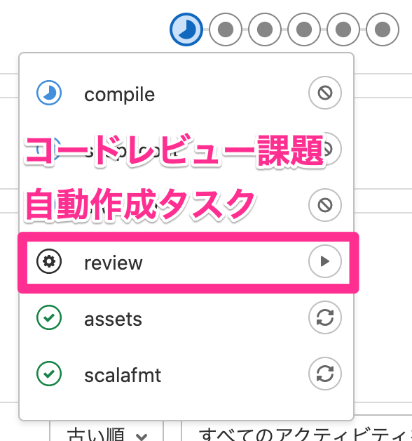
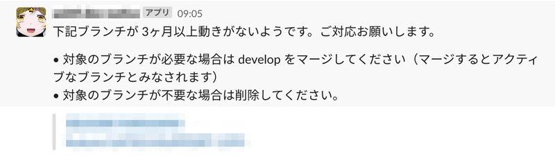
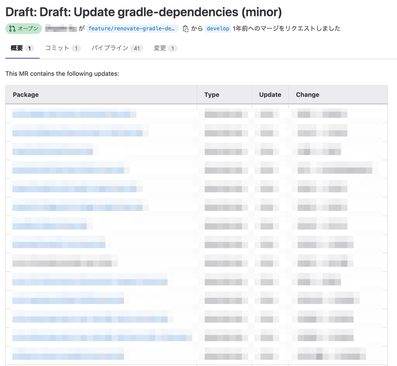
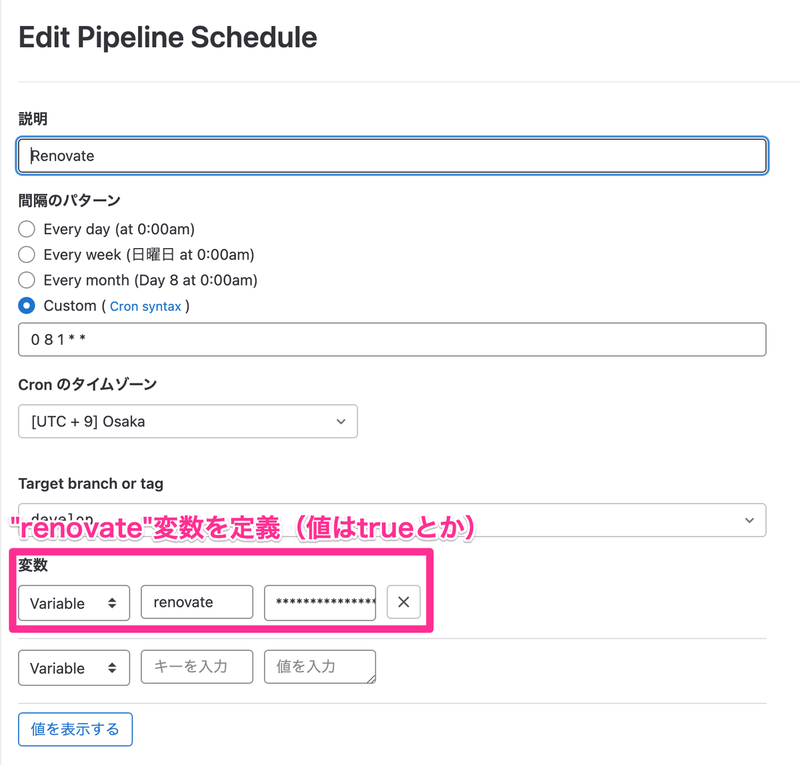

https://www.m3tech.blog/entry/2023/01/01/120000

---

これはエムスリー Advent Calendar 2022の32日目の記事です。 前日は[@po3rin](https://twitter.com/po3rin)による、ただのソフトウェアエンジニアが検索エンジニアになるまで でした。

あけましておめでとうございます。エムスリーエンジニアリンググループでScalaとマミさんが好きな安江です。アドカレを購読しているみなさま、またお目に掛かりましたね。素敵な出会いはたくさんあって欲しいですが、プログラマなら似たコードとの出会いは少なくしたいものです。[今年度のAI・機械学習のベストMR](https://www.m3tech.blog/entry/2022/12/23/160000)第1位に輝いたのも[GitLab CIテンプレート用リポジトリの作成](https://www.m3tech.blog/entry/2022/12/23/160000#%E7%AC%AC1%E4%BD%8D-GitLab-CI%E3%83%86%E3%83%B3%E3%83%97%E3%83%AC%E3%83%BC%E3%83%88%E7%94%A8%E3%83%AA%E3%83%9D%E3%82%B8%E3%83%88%E3%83%AA%E3%81%AE%E4%BD%9C%E6%88%90)という、[GitLab CIのテンプレート](https://docs.gitlab.com/ee/development/cicd/templates.html)に関するものでした。本記事では、私が布教したGitLab CIのテンプレートの実例を3つ紹介したいと思います。

# 1. レビュー依頼ジョブ

  
レビュー依頼ジョブ

[こちらの記事](https://www.m3tech.blog/entry/2022/03/29/110206)(([以前の記事](https://www.m3tech.blog/entry/2022/03/29/110206)では各リポジトリにて個別にレビュー依頼ジョブを作成していましたが、nodeによる実装をGitLab CIテンプレートで配布する形に変更されました。これにより、展開の速度が加速しました。))でも紹介しましたが、レビューの依頼は単にマージリクエストを作成して終わり、というのは滅多にありません。対応する課題を作ったり、slackに依頼したりと、チームによってさまざまです。複雑な手順は、普段から開発しているメンバーにとっても煩わしいですし、チーム外からコントリビュートしたいメンバーにとってはとてもハードルが高いものになります。こちらのテンプレはGitLab CIジョブにレビュー依頼を作成します。これによって、レビュー依頼はこちらのジョブを手動実行する、というインタフェースに統一され、気軽にレビュー依頼できるようになりました。やったね！

# 2. 古いブランチの通知

  
古いブランチの通知

皆さんが管理するリポジトリに古いブランチはありませんか？必要以上に残ってしまったトピックブランチの対処、問題になっていたりしませんか？こちらのジョブは3か月動きがなかったブランチ((GitLabでは、3か月以上動きがなかったブランチは「古いブランチ」として表示されるため、それに倣いました。個人的には1か月くらいで通知しても良いかな、と感じています。))の最新コミッターに対してslackに通知します。GitLabの場合、ブランチが削除されると、それに紐づくマージリクエストや環境も破棄されるため、通知のトリガーはブランチだけで良いのです。

不要なブランチはリモートリポジトリサイズの肥大化にも繋がるので、削除しちゃいましょう((正確には、単にブランチを削除するだけでなく、gcしないと容量は解放されません。また、gcしてしまったら永久に取り戻せないので、本当に不要なブランチだけを削除してください。))。年始から綺麗なリポジトリとともに開発できると、気分も晴れやかになること請け合いです。

# 3. renovate, scala stewardのテンプレート

  
renovateによって作成されたマージリクエスト

サービスが依存しているライブラリの更新管理、大変ですよね。もはや一般的になった[renovate](https://docs.renovatebot.com/)や[scala steward](https://github.com/scala-steward-org/scala-steward#readme)の導入を手軽にするテンプレートを用意しました。特にrenovateのテンプレートは、私が所属するチーム以外でも採用されました。需要の高さが伺えますね。是非、読者の皆さんにも使ってもらいたいので、ここに弊社で使っている実例を置いておきますね。

（scala stewardの実例は[過去の記事](https://www.m3tech.blog/entry/2022/06/13/142100)をご参照ください）

## renovate

テンプレートリポジトリに下記のymlを置きます。環境変数などは[こちらを参考](https://docs.renovatebot.com/modules/platform/gitlab/)に設定してください。

```yml
.renovate:
  image:
    name: renovate/renovate:latest
    entrypoint: [ "" ]
  script:
    - renovate
      --platform gitlab
      --endpoint "GitLabのAPIのベースURL"
      --allowed-post-upgrade-commands='[".*"]'
      "${CI_PROJECT_PATH}"
  variables:
    RENOVATE_TOKEN: ${RENOVATE_TOKEN}
    GITHUB_COM_TOKEN: ${GITHUB_COM_TOKEN}
```

導入先のリポジトリに `renovate.json` を置きます。Java+JavaScriptの例を下記に示します。

```json
{
  "extends": ["config:base"],
  "includePaths": ["pom.xml", "src/main/resources/package.json"],
  "timezone": "Asia/Tokyo",
  "enabledManagers": ["maven", "npm"],
  "addLabels": ["レビュー待ち"],
  "branchPrefix": "renovate/",
  "separateMinorPatch": true,
  "packageRules": [
    {
      "groupName": "backend-dependencies",
      "matchManagers": "maven"
    },
    {
      "groupName": "frontend-dependencies",
      "matchManagers": "npm",
      "matchDepTypes": ["dependencies", "devDependencies"]
    }
  ],
  "baseBranches": ["develop"],
  "prFooter": "This PR has been generated by [Renovate Bot](https://github.com/renovatebot/renovate)."
}
```

導入先のリポジトリの `.gitlab-ci.yml` に以下を追加します。

```yml
include:
  - project: m3/ci-templates # テンプレートリポジトリ名
    ref: master
    file: renovate/renovate.yml # テンプレートファイルのルートからのパス

renovate_manual:
  extends: .renovate
  needs: [ ]
  rules:
    - if: '$CI_PIPELINE_SOURCE == "schedule" || $CI_PIPELINE_SOURCE == "merge_request_event"'
      when: never
    - if: $CI_COMMIT_BRANCH == "develop"
      when: manual
      allow_failure: true

renovate_scheduled:
  extends: .renovate
  needs: [ ]
  rules:
    - if: '$CI_PIPELINE_SOURCE == "schedule" && $CI_COMMIT_BRANCH == "develop" && $renovate'
```

`renovate_manual`はtestステージに出現する手動ジョブで、デバッグ用です。`renovate_scheduled`をスケジュール登録することで、developブランチのライブラリの更新を監視できるようになります。他のスケジュールジョブと干渉を防ぐために`renovate`変数が定義されている場合のみ、実行されるようになっています。

  
スケジュール登録の例

# We're hiring !!!

エムスリーでは、GitLab CIを使った業務改善や、テンプレートによる効率化に興味がある方も募集しています。もちろんScalaに興味がある方も絶賛募集しています！ちょっとでも気になったら下記をご確認ください。

https://jobs.m3.com/engineer/
