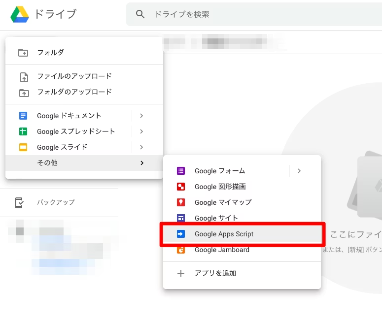
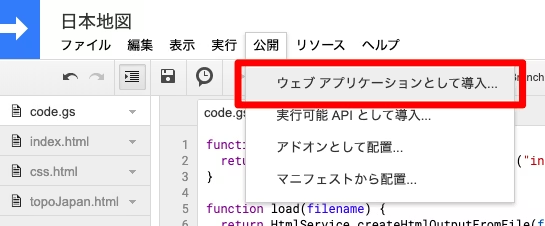
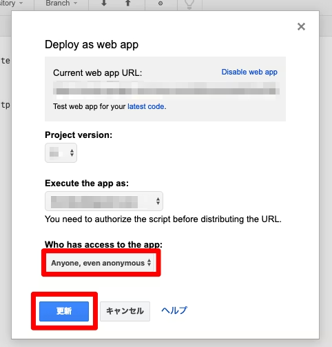

https://qiita.com/kijuky/items/d5dff2c63912ddd71521

---

GAS(Google App Script) で日本地図を表示します。D3のバージョン違いで結構つまずいたので、2020年1月時点での下記バージョンでの例をまとめておきます。

- d3.js v5.15.0
- topojson v3.0.2

# ツールのインストール

地図データを変換するために使うツールをインストールします。

```bash
$ brew install gdal node jq
$ npm i -g topojson json-to-js
```

# 地図データのダウンロード

地図データは[元記事](https://qiita.com/ran/items/d88c5126362576be3291)と同じ通り、[Natural Earth](http://www.naturalearthdata.com/)から地図データをダウンロードします。

```bash
$ curl -#L http://www.naturalearthdata.com/http//www.naturalearthdata.com/download/10m/cultural/ne_10m_admin_1_states_provinces.zip | bsdtar -xf- -C .
```

日本地図データの GeoJSON を作成します。

```bash
$ ogr2ogr -f GeoJSON -where "adm0_a3 = 'JPN'" pref.json ne_10m_admin_1_states_provinces.shp
```

同様に`静岡県`の修正をします。

```bash
$ cat pref.json | jq '.features[30].properties.name_local|="静岡県"' > pref2.json
```

次に TopoJSON を作成します。

```bash
$ geo2topo -p name -p name_local -p latitude -p longitude -o japan.json pref2.json
```

作成された japan.json を後の GAS で使いやすくするために、JavaScript のリテラルに変換します。

```bash
$ cat japan.json | json-to-js > japan.js
```

# GASでHTMLを用意する

Google Drive を開き、Google Apps Script を新規作成します。


下記３つのファイルを追加します。

```javascript:コード.gs
function doGet() {
  return HtmlService.createTemplateFromFile("index").evaluate();
}
```

```html:index.html
<!DOCTYPE html>
<html>
  <head>
    <base target="_top">
    <script src="https://d3js.org/d3.v5.min.js"></script>
    <script src="https://unpkg.com/topojson@3"></script>
  </head>
  <body>
    <div class="japan"></div>
    <script>
      var width = 960,
          height = 1160;
      var color = d3.scaleOrdinal(d3.schemeCategory10);
      var projection = d3.geoMercator()
        .center([135, 35])
        .scale(2400)
        .translate([width / 2, height / 2]);
      var path = d3.geoPath().projection(projection);
      var svg = d3.select(".japan").append("svg")
        .attr("width", width)
        .attr("height", height);
      var topoJapan = <?!= HtmlService.createHtmlOutputFromFile("topoJapan").getContent() ?>;
      var geoJapan = topojson.feature(topoJapan, topoJapan.objects.pref);
      svg.selectAll(".pref")
        .data(geoJapan.features)
        .enter()
        .append("path")
        .attr("stroke", "#999")
        .attr("fill", "none")
        .attr("d", path);
    </script>
  </body>
</html>
```

元記事では `d3.json(...).then(...)` を使っているが、GAS では XHR が使えないため、作成した japan.js をそのまま読み込ませている。

```javascript:topoJapan.html
/* TODO: japan.js ファイルをコピー */
```

ここで、GAS ではすごく長い１行をレンダリングするために５分くらいかかってしまうので、**絶対に japan.json を GAS に貼り付けてはいけない。**（体験談）


# ウェブに公開する

公開 > ウェブアプリケーションとして導入... をクリック


アクセスを全員にして、公開/更新をクリック。



実際のページはこちら
https://script.google.com/macros/s/AKfycbyhpbiK4wsFBwEI0uKT6iOctE9mK9f4-LxrpgRiLGnBb61nqA5o/exec

# 参考

- https://qiita.com/ran/items/d88c5126362576be3291
- http://deep-blend.com/jp/2014/06/d3-js-map-japanese-map/
