https://qiita.com/kijuky/items/0979327cf7e7c091da02

---

この記事では、化学工学の知識の普及のためにそのシミュレータである COFE の共有と、その例として水-エタノールを蒸留塔を使って高純度のエタノールを合成するシミュレーションを行います。

# はじめに

昨今の新型コロナウィルスの流行でアルコール消毒が注目されています。そのアルコールの一種であるエタノールを高純度で分離する方法の１つが蒸留です。これによって高純度のエタノールを合成することができ、消毒用のアルコールだったり、他にも食品や燃料にも利用されます。
日本では中学化学で蒸留を習います。簡単に復習すると、水とエタノールの混合液を蒸発させ、凝縮させると、エタノール純度の高い混合液を得ることができるというものです。ちなみに、この実験で得られる混合液の濃度は最初に用意する混合液の濃度によって決まっており、下記のグラフから一意に求められます。

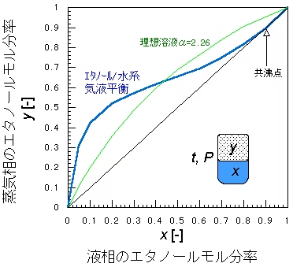
https://chemeng.web.fc2.com/ice/ice_s3.html より

グラフの引用先にもあるように、蒸留した混合液を更に蒸留することで、理想的には共沸点の濃度まで濃縮させることができます。これを工業的に実現したものが蒸留塔です。蒸留塔は一つ一つの段で蒸留状況を作り上げることで、（定常状態に於いて）塔全体で蒸留を複数回繰り返す状況を作り出す装置です。

さて、では高純度のエタノールを合成したいとなった場合、蒸留塔を製作する必要がありますが、一体どんな蒸留塔が必要になるでしょうか？もちろん、「蒸留塔」と呼ばれる製品がポンとあるわけではなく、それぞれ製品スペックがあり、その製品スペックによっては純度が低いものを合成してしまったり、逆にオーバースペック（蒸留塔の上の段ではほとんどエタノール濃度が変わらない）の蒸留塔を作ってはもったいないですよね（これはパソコンのスペックを選ぶのと似ているかもしれませんね）。実際の化学工学の分野では理論的に計算したり、数値シミュレーションしたりしてスペックを求めます。今回は COFE と呼ばれるシミュレータを用いて水-エタノールの分離シミュレーションを行ってみます。

# CAPE-OPEN と COFE

今回紹介する COFE 以外にも化学プロセスをシミュレーションするソフトウェアはたくさんあります。有名なものとしては [Aspen Plus](https://www.aspentech.com/en/products/engineering/aspen-plus) や [Hysys](https://www.aspentech.com/en/products/engineering/aspen-hysys) などです。ただし、多くの化学プロセスシミュレータはそれぞれデータの互換性がありませんでした。そこで、化学プロセスシミュレーションのための統一規格が欧州で作られました。それが [CAPE-OPEN](https://www.colan.org/) です。COFE はその CAPE-OPEN の参照実装と考えて差し支えありません。

蛇足ですが、自動車の [OSEK](https://ja.wikipedia.org/wiki/OSEK) とかも欧州で作られていましたね。欧州は国がたくさんあるので統一規格を作るのが盛んなイメージが個人的にあります。

## COFE のインストール

※以降は Windows 必須です。

[COFE のダウンロードサイト](https://www.cocosimulator.org/index_download.html)からダウンロードします。執筆当時の更新日時は May 29, 2020 でした。積極的に開発されていますね。

こちらのインストーラーを実行すると多くの関連ソフトウェアがインストールされます。とりあえず全部必要なものなので Next を押してインストールを完了させましょう。

## COFE の実行

Windows 10 だと、スタートメニュー横の「🔎ここに入力して検索」で `COFE` と打つと、候補が現れるので、それを実行します。下記のような画面が出てくればインストール成功です。ひとまずお疲れさまでした。

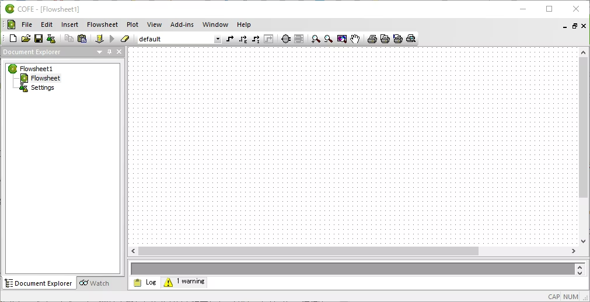

以前に Aspen Plus や Hysys を触ったことがある人ならば、上記がフローシートなので、自由に単位操作を追加してシミュレーションを実行できますので、それで遊んでも良いでしょう。ここでは、それらを使ったことがない人向けに、本家のサイトからサンプルをダウンロードしてシミュレーションを体験してみます。

# 水-エタノール分離シミュレーション

先程 COFE をダウンロードしたサイトには、様々なサンプルシミュレーションがあり、水-エタノール分離シミュレーションも存在します。今回は下記をダウンロードしてみましょう。

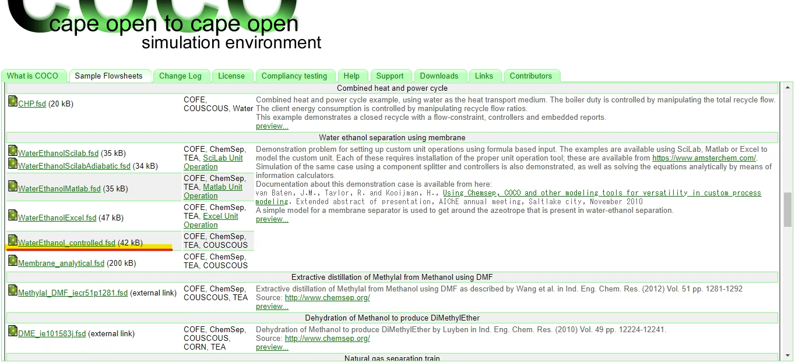
https://www.cocosimulator.org/index_sample.html
赤線で引いたサンプルデータをダウンロードします。

ダウンロードしたデータを開くと、このような図が表示されます。これが蒸留塔による水-エタノール分離シミュレーションのフローシートになります。

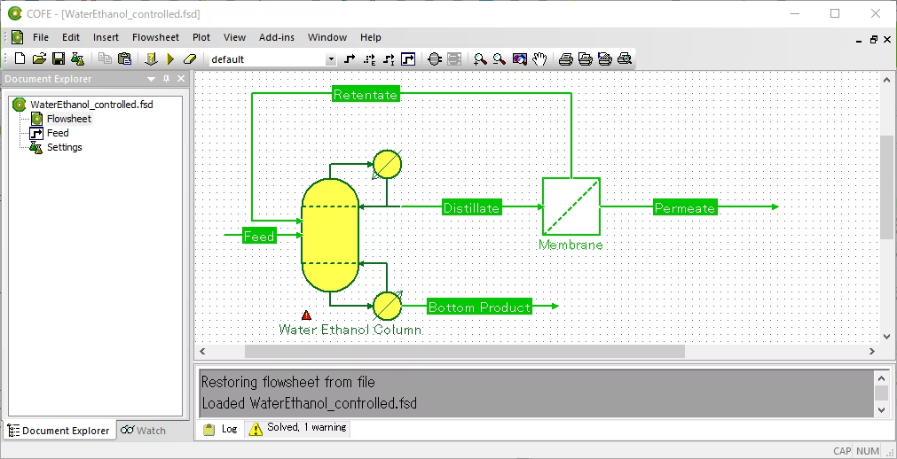

簡単に説明すると、 `Feed` と呼ばれるところに水-エタノール混合液を流します。すると `Permeate` に濃縮エタノールが出力され、 `Bottom Product` に水が出力されるプロセスになります。`Feed` をダブルクリックするとどのような混合液かを確認できます。今回は水:エタノール≒6:3くらいですね。

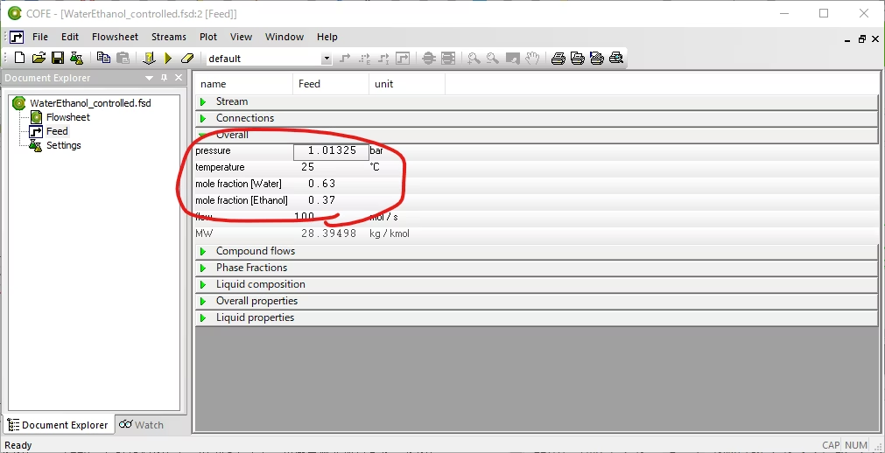

では、早速シミュレーションしてみましょう。シミュレーションは上の三角ボタンを押します。

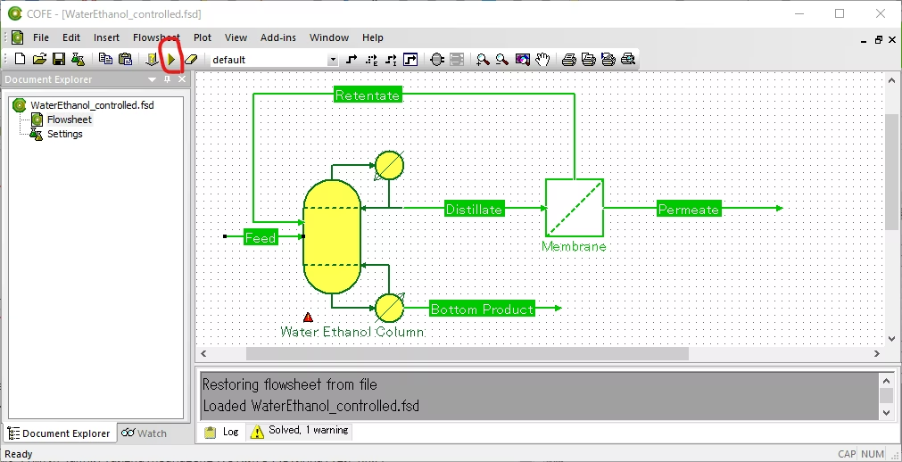

しばらくすると制御が返ってくるので、 `Permeate` をダブルクリックしてみましょう。するとエタノールが 99.4% とでましたね。無事、エタノールが分離できていることがわかるかと思います。

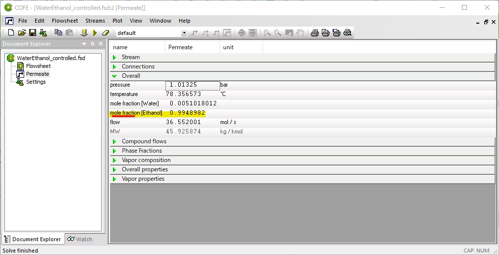

## 数値を変えてみよう

サンプルでは蒸留塔の段の数は 20 に設定されています。蒸留塔は段の数が多いほど分離性能が良くなりますが、設備コストが上がります。今回は試しにこれを半分の 10 に設定して再シミュレーションしてみましょう。

蒸留塔のアイコンをダブルクリックすると単位操作のプロパティシートが出てくるので `Edit` ボタンを押します。

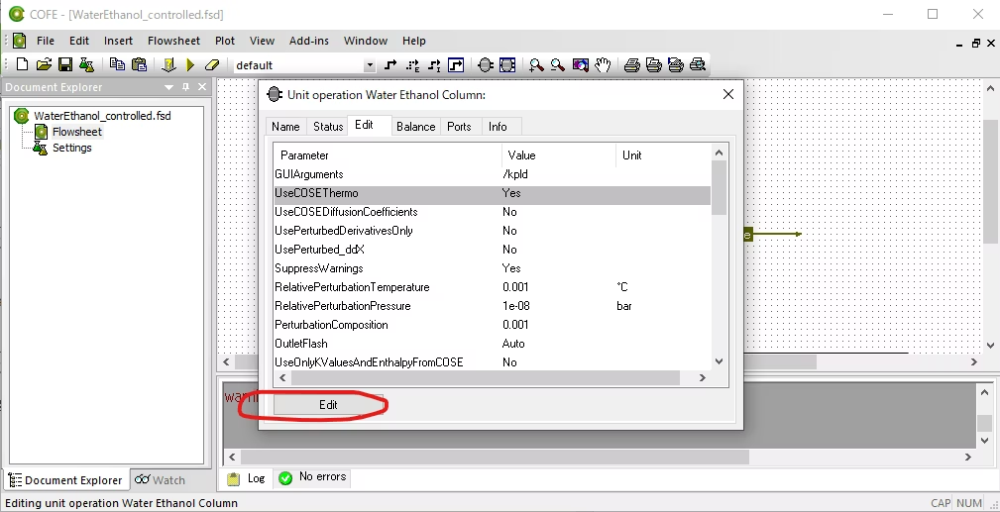

別のウィンドウが現れます。これは単位操作の詳細を変更できるアプリケーションです。ここで `Operation` を選び、段数を 20 から 10 に変更します（ `Feed` は自動で変更されます）。セーブボタンを押してアプリケーションを終了させます。

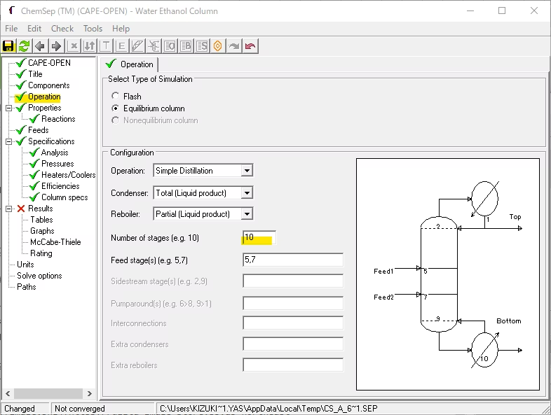

再シミュレーションしてみましょう。再シミュレーションする際は、再生ボタンの横のリセットボタンを押して、前回のシミュレーション結果を消してから行います。

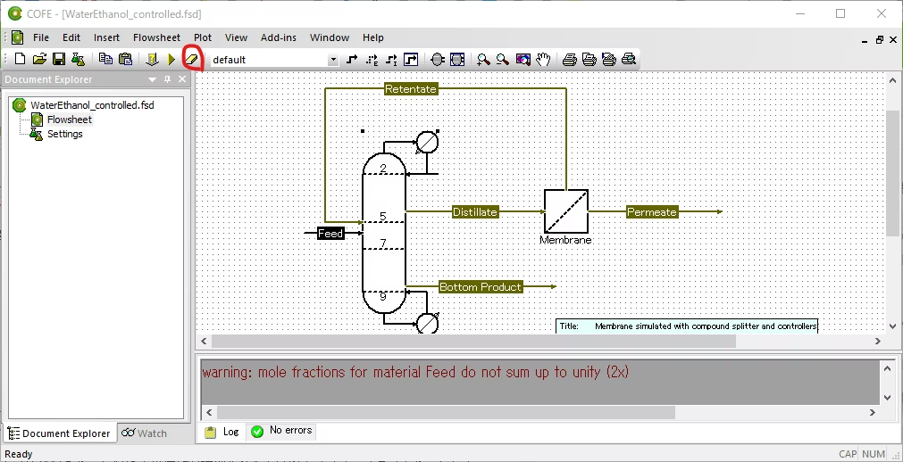

再シミュレーション結果はこちらになります。エタノールの収率は 99.3% です。先程から 0.1% 減ってしまいましたね。でも段数は半分に減らせたので、ぼちぼちといったところでしょうか。

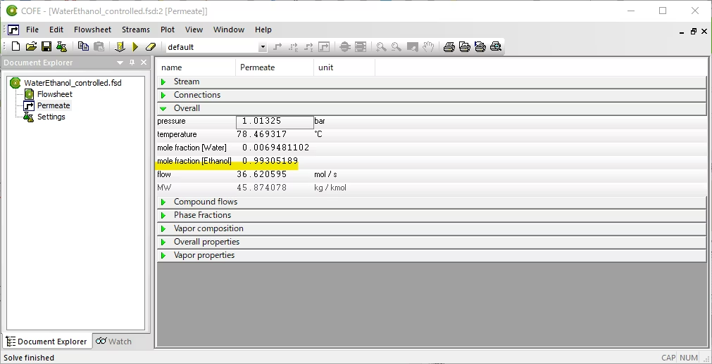

# まとめ

今回は COFE を使って化学プロセスのシミュレーションをしてみました。通常、化学プロセスのシミュレーションを行う場合、Aspen Plus や Hysys などの有料ソフトを利用する必要がありますが、COFE を使うことで無料で化学プロセスのシミュレーションを行うことができました。ぜひ皆さん自身でシミュレーションを行ってみて、化学プロセスの複雑さやその面白さを体験できたなら幸いです。また、多くの工学系の大学ではこのような化学プロセスを専門に扱う研究室があるので、より専門性を極めたいと思った方は工学系の大学の研究室に入ることをおすすめします。

# 蛇足

また、こちらの文章はアルコールを摂取した状態で執筆しているため、読みづらい文章になっているかと思いますが、些細なミスはご愛嬌として受け取っていただけると幸いです。致命的なミスはコメントで指摘いただけると助かります。
