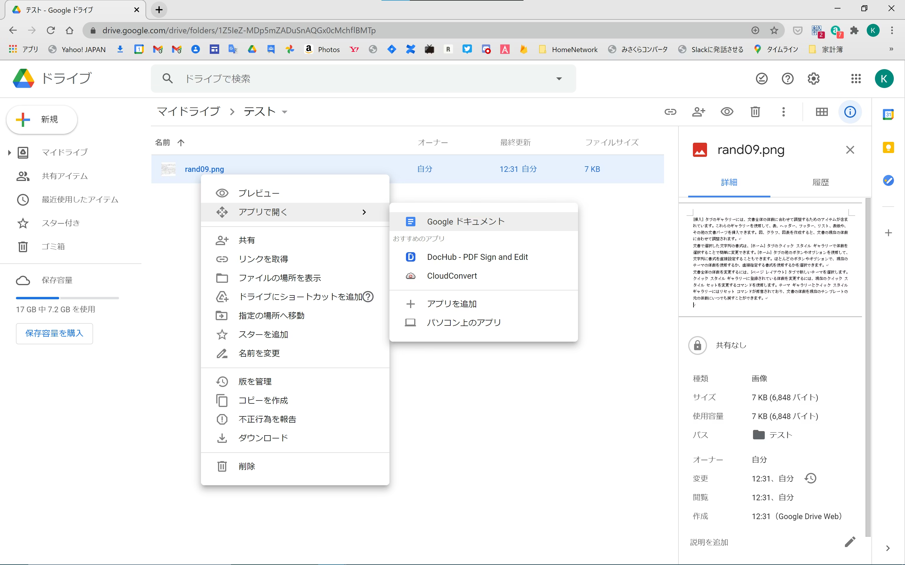
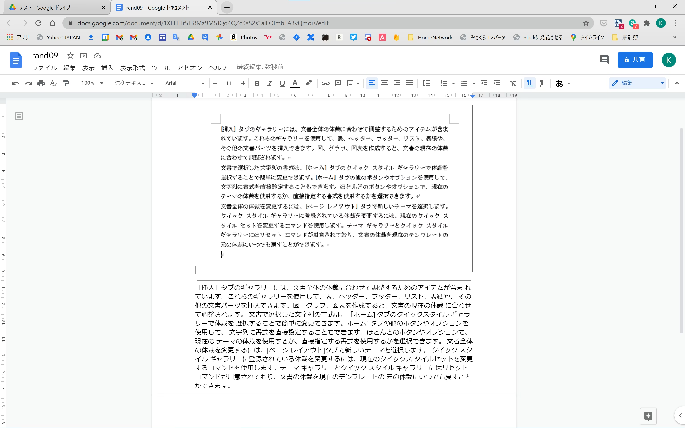
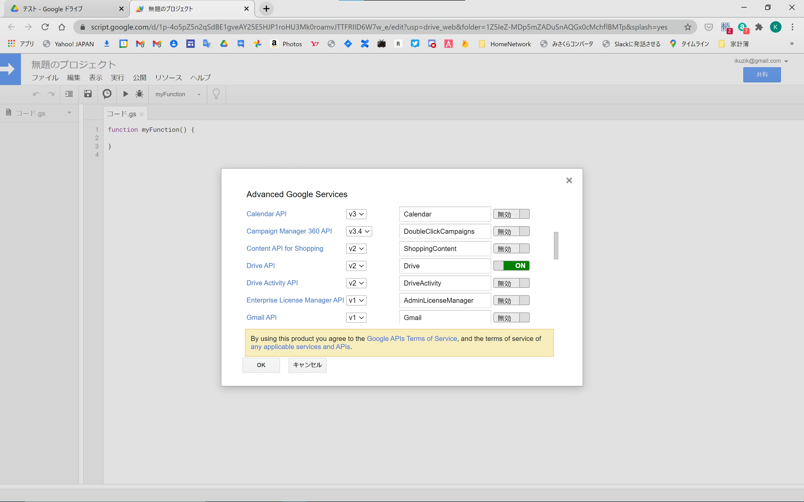

https://qiita.com/kijuky/items/535e769a72343de85573

---

こんにちは。

この記事ではGAS(Google Apps Script)でOCR(画像の文字認識)をする方法を紹介します。

# はじめに

実は Google ドライブにはもともとOCRの機能があります。画像ファイルを右クリックして「Google ドキュメント」で開くと、OCR結果がついてくるのです。

|     |  |
|:------------------------:|:---------------------:|
| **図1. Google ドキュメントで開く** |  **図2. OCR結果がついてくる**  |

GASでOCRをする戦略としては、この変換処理をGASで記述する、ということになります。

# Drive API について

前述の変換を行うためには、GASで通常使う[Drive Service](https://developers.google.com/apps-script/reference/drive)ではなく[Drive API](https://developers.google.com/drive/api/v3/reference)を使う必要があります。Drive APIではDrive Serviceよりも高度な処理をすることができます。

|           |
|:------------------------------:|
| **図3. GAS で Drive API を有効にする** |

# OCRのコード例

上記Drive APIを有効にしたスクリプトで、実際にOCRしてみます。

```javascript
function convertTextFromPDFFile(file, folder) {
  return convertTextFromPDF_(convertDocumentFromPDFFile, file, folder);
}

function convertTextFromPDFBlob(blob, folder) {
  return convertTextFromPDF_(convertDocumentFromPDFBlob, blob, folder);
}

function convertTextFromPDF_(convertDocument, pdf, folder) {
  const document = convertDocument(pdf, folder);
  const text = DocumentApp.openById(document.getId()).getBody().getText();
  document.setTrashed(true);
  return text;
}

function convertDocumentFromPDFFile(file, folder) {
  if (!folder)
    folder = file.getParents().next();
  const blob = file.getBlob();
  return convertDocumentFromPDFBlob(blob, folder);
}

function convertDocumentFromPDFBlob(blob, folder) {
  const fileMeta = {title: blob.getName(), mimeType: MimeType.PDF};
  const result = Drive.Files.insert(fileMeta, blob, {
    convert: true,
    ocr: true,
    ocrLanguage: 'ja'
   });
   const file = DriveApp.getFileById(result.id);
   if (folder) {
     const parents = file.getParents();
     while (parents.hasNext())
       parents.next().removeFile(file);
     folder.addFile(file);
   }
   return file;
}
```

使い方はこんな感じです。

```javascript
const pdf = /* PDFのファイル */
const text = convertTextFromPDFFile(pdf);

console.log(text); /* PDFのOCR結果がコンソールに出力される */
```

# 実際に使ってみた例

プライベートや業務でもいろいろと使ってみましたが、それなりに課題もあるので、お手軽さが発生する課題よりも重視されれば、採用するのもありかもしれません。

## 例1. レシートのOCR

我が家では、家計簿をGoogleスプレッドシートで管理していました。買い物したあとのレシートの入力が億劫になってきたので、このOCR機能を使って、レシートの入力を自動化しようと考えました。

家にはScanSnapがあり、ScanSnapには保存場所にGoogleドライブを指定することができました。そこで、ScanSnapでレシートをスキャンすると、Googleドライブにスキャン結果が保存され、適当なトリガーでスキャン結果がOCRされ、Googleスプレッドシートに転記される、という一連の流れを作ってみました。

自動的に入力されることはとても便利なのですが、OCR結果をGoogleスプレッドシートに転記する場合、どうしても正規表現で頑張る必要がある、またレシートの種類に応じて正規表現を変更する必要があるので、なかなかの実装量が必要になりました。３～４店舗しか利用しない、ということであればギリいけそうな気もしますが、マネーフォワードやLINE家計簿みたいなサービスがある中で正規表現を頑張るのは徒労でしかないので、最終的には使わなくなりました。無念です。。

## 例2. PDFのOCR

某厚労省の書類はPDFで提供されることがあります。また、そのPDFに感染者数とかが書いてあったり、その感染者数の毎日の変化をグラフにしたかったりもすることがあります。当初はPDFのフォーマットが数日で変わってしまうことが多かったので、自動化に向ていないと判断し手入力していましたが、５月頃からフォーマットが固まってきたため、GASで自動化することにしました。

たとえフォーマットが固まっていたとしても、PDFファイルに文字情報が存在しない場合はうまくOCRできなかったり、「青」や「長」が部首の文字として認識され、青森県や長野県が認識されないなどの細かな不具合はありましたが、これは基本的にはうまく自動化することができました。結果、手入力の工数がゼロになりました。よかった。

# まとめ

GASでOCRをする方法を紹介しました。自分でOCRライブラリなどを準備する必要もなく手軽に試せるため、すぐに結果を出せると思います。実際に使ってみたところ、OCRするフォーマットが固まっているなら自動化の工数がペイできると思いました。手書き文字はあまり精度よく認識できなかったので、手書きのFAXをOCRにかけるみたいなのは難しいかもしれません。

特に文字情報が入っているPDFはOCR結果は安定するので、例えば関連論文とかをOCRして結果をBQに突っ込んでいろいろ解析する、とかの応用もできるかもしれません。

以上です。

# 参考リンク

- [LINE Messaging API + GAS + Googleドライブ OCR で家計のスナップショットをグラフ化](https://qiita.com/okadato623/items/a415104f5349e5445a6d)
