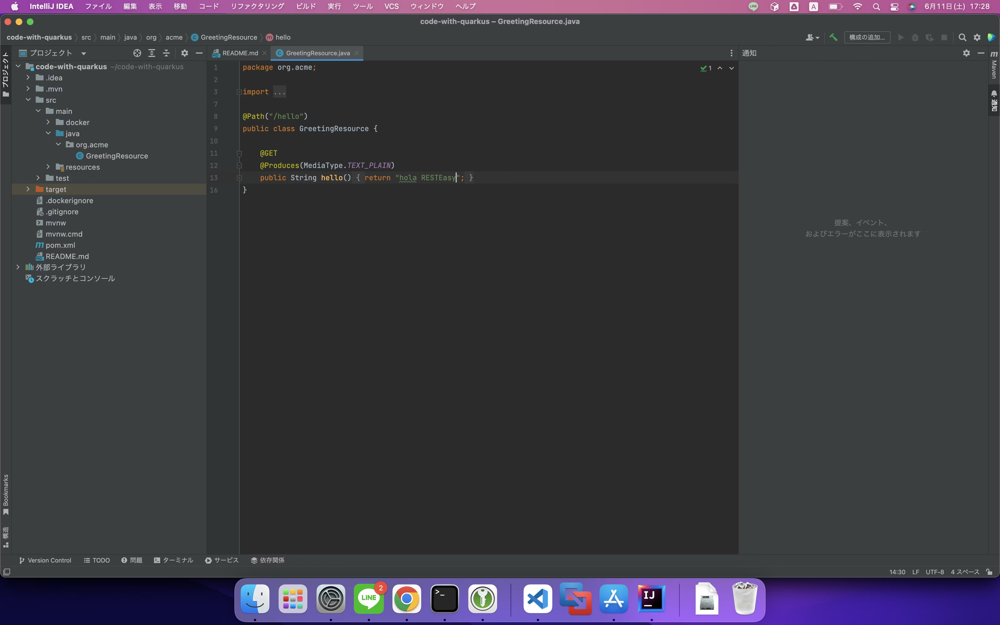

https://qiita.com/kijuky/items/15b78a0a8ce96ceac14a

---

先日TwitterみてたらQuarkusという単語を見かけました。会社のSlackでも同じ単語を見かけたので、軽く調べてみて「入門」をやってみました。

# Quarkus とは

一言で言えばJavaベースの軽量Webサーバーっぽいです。インスタンスぽんぽん立ててスケールアウトするクラウド時代に即したものらしいです。

https://ja.quarkus.io/about/

「入門」記事があったのでやってみました。

https://ja.quarkus.io/get-started/

# インストール

macOSでやってみました。まずは quarkus cli をダウンロードするようです。

```
% brew install quarkusio/tap/quarkus
...(省略)
% quarkus --version
The operation couldn’t be completed. Unable to locate a Java Runtime.
Please visit http://www.java.com for information on installing Java.

The operation couldn’t be completed. Unable to locate a Java Runtime.
Please visit http://www.java.com for information on installing Java.
```

JDK のインストールが必要だそうです。

```
% brew install java
...(省略)
% javac --version
javac 18.0.1.1
% quarkus --version
The operation couldn’t be completed. Unable to locate a Java Runtime.
Please visit http://www.java.com for information on installing Java.

2.7.6.Final
```

うーん？ちょっと気になりますが、バージョン表示されたので良しとしましょう。

# アプリケーションの作成

```
% quarkus create && cd code-with-quarkus
The operation couldn’t be completed. Unable to locate a Java Runtime.
Please visit http://www.java.com for information on installing Java.

Creating an app (default project type, see --help).
Looking for the newly published extensions in registry.quarkus.io
-----------

applying codestarts...
📚  java
🔨  maven
📦  quarkus
📝  config-properties
🔧  dockerfiles
🔧  maven-wrapper
🚀  resteasy-codestart

-----------
[SUCCESS] ✅  quarkus project has been successfully generated in:
--> ~/code-with-quarkus
-----------
Navigate into this directory and get started: quarkus dev
```

よさそう

# アプリケーションの実行

```
% quarkus dev
The operation couldn’t be completed. Unable to locate a Java Runtime.
Please visit http://www.java.com for information on installing Java.

The operation couldn’t be completed. Unable to locate a Java Runtime.
Please visit http://www.java.com for information on installing Java.

  % Total    % Received % Xferd  Average Speed   Time    Time     Time  Current
                                 Dload  Upload   Total   Spent    Left  Speed
100 58727  100 58727    0     0  94392      0 --:--:-- --:--:-- --:--:-- 95336
[INFO] Scanning for projects...

...(省略。mvnで依存ライブラリを取得している）

Listening for transport dt_socket at address: 5005
__  ____  __  _____   ___  __ ____  ______ 
 --/ __ \/ / / / _ | / _ \/ //_/ / / / __/ 
 -/ /_/ / /_/ / __ |/ , _/ ,< / /_/ /\ \   
--\___\_\____/_/ |_/_/|_/_/|_|\____/___/   
2022-06-11 17:16:54,434 INFO  [io.quarkus] (Quarkus Main Thread) code-with-quarkus 1.0.0-SNAPSHOT on JVM (powered by Quarkus 2.9.2.Final) started in 1.294s. Listening on: http://localhost:8080

2022-06-11 17:16:54,447 INFO  [io.quarkus] (Quarkus Main Thread) Profile dev activated. Live Coding activated.
--
All 1 test is passing (0 skipped), 1 test was run in 1794ms. Tests completed at 17:17:20.
Press [r] to re-run, [o] Toggle test output, [:] for the terminal, [h] for more options>
```

`Listening on: http://localhost:8080` というので開いてみた。


いい感じ。

# ライブコーディング

> お好きなIDE でsrc/main/java/GreetingsResource.java を開き、 "hello RESTEasy" を "hola RESTEasy" に変更してください。

IntelliJ でやってみました。



変更するとコンソールにテストが出力されました。ファイルが保存されたのをトリガーにテストを走らせてくれるんですね。面白い。

```
2022-06-11 17:28:37,042 ERROR [io.qua.test] (Test runner thread) ==================== TEST REPORT #2 ====================
2022-06-11 17:28:37,042 ERROR [io.qua.test] (Test runner thread) Test GreetingResourceTest#testHelloEndpoint() failed 
: java.lang.AssertionError: 1 expectation failed.
Response body doesn't match expectation.
Expected: is "Hello RESTEasy"
  Actual: hola RESTEasy

	at java.base/jdk.internal.reflect.DirectConstructorHandleAccessor.newInstance(DirectConstructorHandleAccessor.java:67)
	at java.base/java.lang.reflect.Constructor.newInstanceWithCaller(Constructor.java:499)
	at java.base/java.lang.reflect.Constructor.newInstance(Constructor.java:483)
	at org.codehaus.groovy.reflection.CachedConstructor.invoke(CachedConstructor.java:72)
	at org.codehaus.groovy.runtime.callsite.ConstructorSite$ConstructorSiteNoUnwrapNoCoerce.callConstructor(ConstructorSite.java:105)
	at org.codehaus.groovy.runtime.callsite.CallSiteArray.defaultCallConstructor(CallSiteArray.java:59)
	at org.codehaus.groovy.runtime.callsite.AbstractCallSite.callConstructor(AbstractCallSite.java:263)
	at org.codehaus.groovy.runtime.callsite.AbstractCallSite.callConstructor(AbstractCallSite.java:277)
	at io.restassured.internal.ResponseSpecificationImpl$HamcrestAssertionClosure.validate(ResponseSpecificationImpl.groovy:499)
	at io.restassured.internal.ResponseSpecificationImpl$HamcrestAssertionClosure$validate$1.call(Unknown Source)
	at io.restassured.internal.ResponseSpecificationImpl.validateResponseIfRequired(ResponseSpecificationImpl.groovy:684)
	at java.base/jdk.internal.reflect.DirectMethodHandleAccessor.invoke(DirectMethodHandleAccessor.java:104)
	at java.base/java.lang.reflect.Method.invoke(Method.java:577)
	at org.codehaus.groovy.runtime.callsite.PlainObjectMetaMethodSite.doInvoke(PlainObjectMetaMethodSite.java:43)
	at org.codehaus.groovy.runtime.callsite.PogoMetaMethodSite$PogoCachedMethodSiteNoUnwrapNoCoerce.invoke(PogoMetaMethodSite.java:193)
	at org.codehaus.groovy.runtime.callsite.PogoMetaMethodSite.callCurrent(PogoMetaMethodSite.java:61)
	at org.codehaus.groovy.runtime.callsite.AbstractCallSite.callCurrent(AbstractCallSite.java:185)
	at io.restassured.internal.ResponseSpecificationImpl.body(ResponseSpecificationImpl.groovy:99)
	at io.restassured.internal.ValidatableResponseOptionsImpl.body(ValidatableResponseOptionsImpl.java:238)
	at io.restassured.internal.ValidatableResponseImpl.super$2$body(ValidatableResponseImpl.groovy)
	at java.base/jdk.internal.reflect.DirectMethodHandleAccessor.invoke(DirectMethodHandleAccessor.java:104)
	at java.base/java.lang.reflect.Method.invoke(Method.java:577)
	at org.codehaus.groovy.reflection.CachedMethod.invoke(CachedMethod.java:107)
	at groovy.lang.MetaMethod.doMethodInvoke(MetaMethod.java:323)
	at groovy.lang.MetaClassImpl.invokeMethod(MetaClassImpl.java:1268)
	at org.codehaus.groovy.runtime.ScriptBytecodeAdapter.invokeMethodOnSuperN(ScriptBytecodeAdapter.java:144)
	at io.restassured.internal.ValidatableResponseImpl.body(ValidatableResponseImpl.groovy:293)
	at io.restassured.internal.ValidatableResponseImpl.body(ValidatableResponseImpl.groovy)
	at org.acme.GreetingResourceTest.testHelloEndpoint(GreetingResourceTest.java:18)
	at java.base/jdk.internal.reflect.DirectMethodHandleAccessor.invoke(DirectMethodHandleAccessor.java:104)
	at java.base/java.lang.reflect.Method.invoke(Method.java:577)
	at io.quarkus.test.junit.QuarkusTestExtension.runExtensionMethod(QuarkusTestExtension.java:1008)
	at io.quarkus.test.junit.QuarkusTestExtension.interceptTestMethod(QuarkusTestExtension.java:827)
	at org.junit.jupiter.engine.execution.ExecutableInvoker$ReflectiveInterceptorCall.lambda$ofVoidMethod$0(ExecutableInvoker.java:115)
	at org.junit.jupiter.engine.execution.ExecutableInvoker.lambda$invoke$0(ExecutableInvoker.java:105)
	at org.junit.jupiter.engine.execution.InvocationInterceptorChain$InterceptedInvocation.proceed(InvocationInterceptorChain.java:106)
	at org.junit.jupiter.engine.extension.TimeoutExtension.intercept(TimeoutExtension.java:149)
	at org.junit.jupiter.engine.extension.TimeoutExtension.interceptTestableMethod(TimeoutExtension.java:140)
	at org.junit.jupiter.engine.extension.TimeoutExtension.interceptTestMethod(TimeoutExtension.java:84)
	at org.junit.jupiter.engine.execution.ExecutableInvoker$ReflectiveInterceptorCall.lambda$ofVoidMethod$0(ExecutableInvoker.java:115)
	at org.junit.jupiter.engine.execution.ExecutableInvoker.lambda$invoke$0(ExecutableInvoker.java:105)
	at org.junit.jupiter.engine.execution.InvocationInterceptorChain$InterceptedInvocation.proceed(InvocationInterceptorChain.java:106)
	at org.junit.jupiter.engine.execution.InvocationInterceptorChain.proceed(InvocationInterceptorChain.java:64)
	at org.junit.jupiter.engine.execution.InvocationInterceptorChain.chainAndInvoke(InvocationInterceptorChain.java:45)
	at org.junit.jupiter.engine.execution.InvocationInterceptorChain.invoke(InvocationInterceptorChain.java:37)
	at org.junit.jupiter.engine.execution.ExecutableInvoker.invoke(ExecutableInvoker.java:104)
	at org.junit.jupiter.engine.execution.ExecutableInvoker.invoke(ExecutableInvoker.java:98)
	at org.junit.jupiter.engine.descriptor.TestMethodTestDescriptor.lambda$invokeTestMethod$7(TestMethodTestDescriptor.java:214)
	at org.junit.platform.engine.support.hierarchical.ThrowableCollector.execute(ThrowableCollector.java:73)
	at org.junit.jupiter.engine.descriptor.TestMethodTestDescriptor.invokeTestMethod(TestMethodTestDescriptor.java:210)
	at org.junit.jupiter.engine.descriptor.TestMethodTestDescriptor.execute(TestMethodTestDescriptor.java:135)
	at org.junit.jupiter.engine.descriptor.TestMethodTestDescriptor.execute(TestMethodTestDescriptor.java:66)
	at org.junit.platform.engine.support.hierarchical.NodeTestTask.lambda$executeRecursively$6(NodeTestTask.java:151)
	at org.junit.platform.engine.support.hierarchical.ThrowableCollector.execute(ThrowableCollector.java:73)
	at org.junit.platform.engine.support.hierarchical.NodeTestTask.lambda$executeRecursively$8(NodeTestTask.java:141)
	at org.junit.platform.engine.support.hierarchical.Node.around(Node.java:137)
	at org.junit.platform.engine.support.hierarchical.NodeTestTask.lambda$executeRecursively$9(NodeTestTask.java:139)
	at org.junit.platform.engine.support.hierarchical.ThrowableCollector.execute(ThrowableCollector.java:73)
	at org.junit.platform.engine.support.hierarchical.NodeTestTask.executeRecursively(NodeTestTask.java:138)
	at org.junit.platform.engine.support.hierarchical.NodeTestTask.execute(NodeTestTask.java:95)
	at java.base/java.util.ArrayList.forEach(ArrayList.java:1511)
	at org.junit.platform.engine.support.hierarchical.SameThreadHierarchicalTestExecutorService.invokeAll(SameThreadHierarchicalTestExecutorService.java:41)
	at org.junit.platform.engine.support.hierarchical.NodeTestTask.lambda$executeRecursively$6(NodeTestTask.java:155)
	at org.junit.platform.engine.support.hierarchical.ThrowableCollector.execute(ThrowableCollector.java:73)
	at org.junit.platform.engine.support.hierarchical.NodeTestTask.lambda$executeRecursively$8(NodeTestTask.java:141)
	at org.junit.platform.engine.support.hierarchical.Node.around(Node.java:137)
	at org.junit.platform.engine.support.hierarchical.NodeTestTask.lambda$executeRecursively$9(NodeTestTask.java:139)
	at org.junit.platform.engine.support.hierarchical.ThrowableCollector.execute(ThrowableCollector.java:73)
	at org.junit.platform.engine.support.hierarchical.NodeTestTask.executeRecursively(NodeTestTask.java:138)
	at org.junit.platform.engine.support.hierarchical.NodeTestTask.execute(NodeTestTask.java:95)
	at java.base/java.util.ArrayList.forEach(ArrayList.java:1511)
	at org.junit.platform.engine.support.hierarchical.SameThreadHierarchicalTestExecutorService.invokeAll(SameThreadHierarchicalTestExecutorService.java:41)
	at org.junit.platform.engine.support.hierarchical.NodeTestTask.lambda$executeRecursively$6(NodeTestTask.java:155)
	at org.junit.platform.engine.support.hierarchical.ThrowableCollector.execute(ThrowableCollector.java:73)
	at org.junit.platform.engine.support.hierarchical.NodeTestTask.lambda$executeRecursively$8(NodeTestTask.java:141)
	at org.junitrm.engine.support.hierarchical.Node.around(Node.java:137)
	at org.junit.platform.engine.support.hierarchical.NodeTestTask.lambda$executeRecursively$9(NodeTestTask.java:139)
	at org.junit.platform.engine.support.hierarchical.ThrowableCollector.execute(ThrowableCollector.java:73)
	at org.junit.platform.engine.support.hierarchical.NodeTestTask.executeRecursively(NodeTestTask.java:138)
	at org.junit.platform.engine.support.hierarchical.NodeTestTask.execute(NodeTestTask.java:95)
	at org.junit.platform.engine.support.hierarchical.SameThreadHierarchicalTestExecutorService.submit(SameThreadHierarchicalTestExecutorService.java:35)
	at org.junit.platform.engine.support.hierarchical.HierarchicalTestExecutor.execute(HierarchicalTestExecutor.java:57)
	at org.junit.platform.engine.support.hierarchical.HierarchicalTestEngine.execute(HierarchicalTestEngine.java:54)
	at org.junit.platform.launcher.core.EngineExecutionOrchestrator.execute(EngineExecutionOrchestrator.java:107)
	at org.junit.platform.launcher.core.EngineExecutionOrchestrator.execute(EngineExecutionOrchestrator.java:88)
	at org.junit.platform.launcher.core.EngineExecutionOrchestrator.lambda$execute$0(EngineExecutionOrchestrator.java:54)
	at org.junit.platform.launcher.core.EngineExecutionOrchestrator.withInterceptedStreams(EngineExecutionOrchestrator.java:67)
	at org.junit.platform.launcher.core.EngineExecutionOrchestrator.execute(EngineExecutionOrchestrator.java:52)
	at org.junit.platform.launcher.core.DefaultLauncher.execute(DefaultLauncher.java:114)
	at org.junit.platform.launcher.core.DefaultLauncher.execute(DefaultLauncher.java:95)
	at org.junit.platform.launcher.core.DefaultLauncherSession$DelegatingLauncher.execute(DefaultLauncherSession.java:91)
	at org.junit.platform.launcher.core.SessionPerRequestLauncher.execute(SessionPerRequestLauncher.java:60)
	at io.quarkus.deployment.dev.testing.JunitTestRunner$2.run(JunitTestRunner.java:228)
	at io.quarkus.deployment.dev.testing.ModuleTestRunner$2.run(ModuleTestRunner.java:92)
	at io.quarkus.deployment.dev.testing.TestSupport.runInternal(TestSupport.java:388)
	at io.quarkus.deployment.dev.testing.TestSupport$2.run(TestSupport.java:308)
	at java.base/java.lang.Thread.run(Thread.java:833)


2022-06-11 17:28:37,048 ERROR [io.qua.test] (Test runner thread) >>>>>>>>>>>>>>>>>>>> 1 TEST FAILED <<<<<<<<<<<<<<<<<<<<


--
1 test failed (0 passing, 0 skipped), 1 test was run in 233ms. Tests completed at 17:28:37 due to changes to GreetingResource.class.
Press [r] to re-run, [o] Toggle test output, [:] for the terminal, [h] for more options>
```

...まぁテストは修正していないので死にますね。

http://localhost:8080/hello で確認できます。


# まとめ

Quarkusの「入門」をなぞってみました。ライブコーディングとかもできておもしろそうでした。ググってみたら[ScalaでSlack Botを作っている記事](https://blog.linkode.co.jp/entry/2019/12/06/000000)を見かけたので、次回はこれを目標にしてみます。
