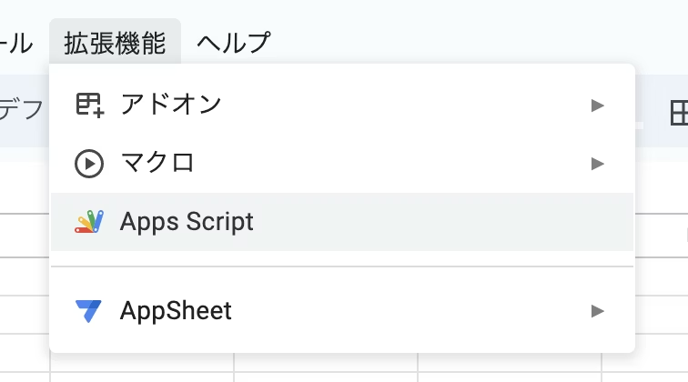
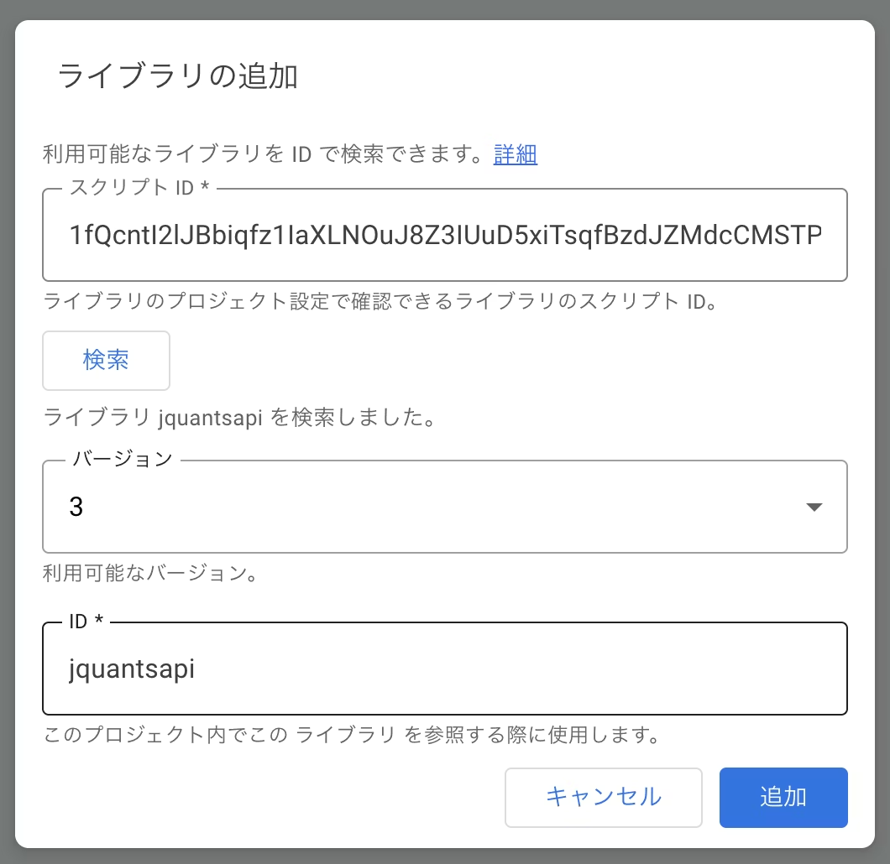
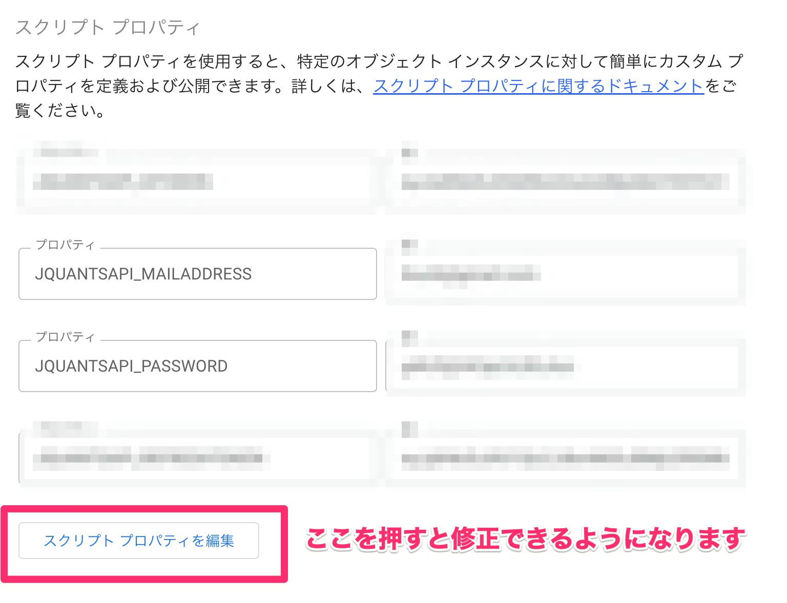
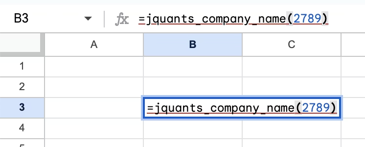
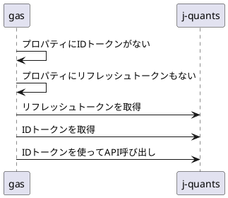

https://qiita.com/kijuky/items/ad638bc07e59343472d1

---

GoogleスプレッドシートでJ-Quants APIを使って企業情報を取得するデモです。

# J-Quants とは

日本取引所グループが提供している証券情報APIです。ユーザー登録することで企業情報をAPIで取得できるようになります。この手のAPIは手軽に使えるWebAPIが存在しないので、このようなサービスはとてもありがたいです。（探しきれてないだけかもしれない）

ただし、無料プランだと2週間前のデータからしか取得できません。リアルタイムの株価情報などを取得する場合は課金する必要があります。

# Googleスプレッドシートの独自関数

Googleスプレッドシートでは、紐づくGASに定義された関数を呼び出すことができます。今回はJ-Quants APIを作ってその関数を呼び出してみましょう。

## 紐づくGASの設定

スプレッドシートから「拡張機能」＞「Apps Script」を選択し、エディタを起動します。



「ライブラリ」に `1fQcntI2lJBbiqfz1IaXLNOuJ8Z3IUuD5xiTsqfBzdJZMdcCMSTPJrsoX` を追加します。



下記のコードを入力し、

```javascript
jquantsapi.setProperties(PropertiesService.getScriptProperties());

function jquants_company_name(code ,date) {
  return jquantsapi.listed_info(code, date).CompanyName;
}
```

スクリプトプロパティにJ-Quantsの認証情報を設定します。

| プロパティ | 値 | 
|:-|:-|
| `JQUANTSAPI_MAILADDRESS`| メールアドレス | 
| `JQUANTSAPI_PASSWORD` | パスワード | 



## 独自関数の呼び出し

Googleスプレッドシートに戻り、`=jquants_company_name(2789)`と入力します。



すると、企業名が表示されます。

# 作ったライブラリについて

説明の途中で追加したライブラリはこちらで公開しています。（もうすでに誰かgasのライブラリ作ってたりするかな...?）

https://github.com/kijuky/gas-jquantsapi

## トークンについて



トークンはスクリプトプロパティに保存するようにしました。スクリプトプロパティに必要なトークンがなければ遡ってトークンを取得しに行きます。取得したトークンはスクリプトプロパティに保存するため、2回目以降の呼び出しはちょっと速くなります。ただし、トークンの期限が切れると、同様に遡ってトークンを取得しに行きます。

## スクリプトプロパティについて

スクリプトプロパティは、PropertiesServiceが呼び出されたプロジェクトに依存するようなので、jquantsapiにクライアントのPropertiesServiceインスタンスを設定してもらうようにします。これで他人の認証情報が共有されることを防ぎます。

```javascript
let properties_ = null;

function setProperties(properties) {
  properties_ = properties;
}

// ...以降は properties_ を使ってスクリプトプロパティを読み書きする。
```

```javascript
// 使う側は自身のプロジェクトのスクリプトプロパティを設定する

jquantsapi.setProperties(PropertiesService.getScriptProperties());
```

## 基準日について

フリープランでは12週間前の日付を設定しないとAPI呼び出しがエラーになります。そのため、基準日が省略された場合は現在時刻から12週間(84日)前の日付をデフォルト値として設定します。

```javascript
function listed_info(code, date = new Date(new Date().setDate(new Date().getDate() - 12 * 7))) {
  //...
}
```

# まとめ

J-Quants APIをGoogleスプレッドシートで使う方法を紹介しました。GASの関数がそのままGoogleスプレッドシートで使えるので、J-Quants API以外のAPIも繋げて色々な情報をGoogleスプレッドシートで一元管理すると面白いかもしれませんね。

