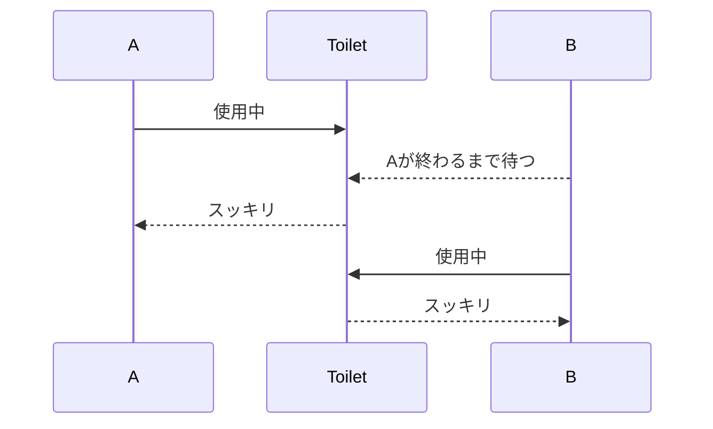
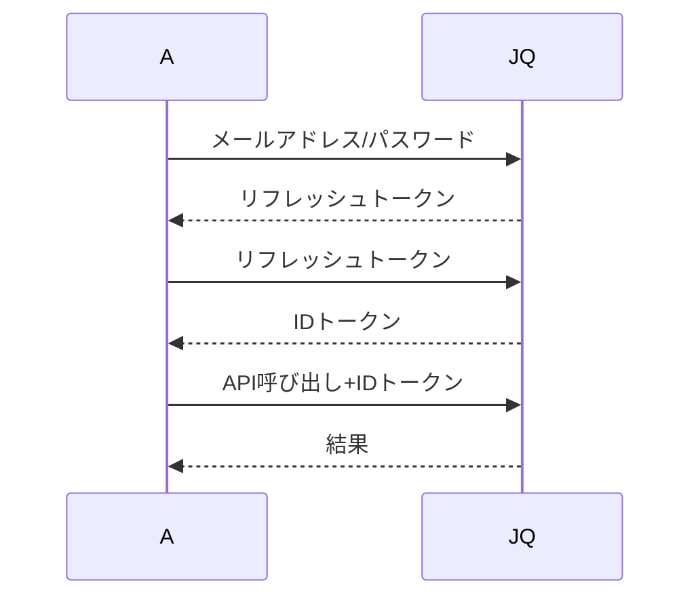
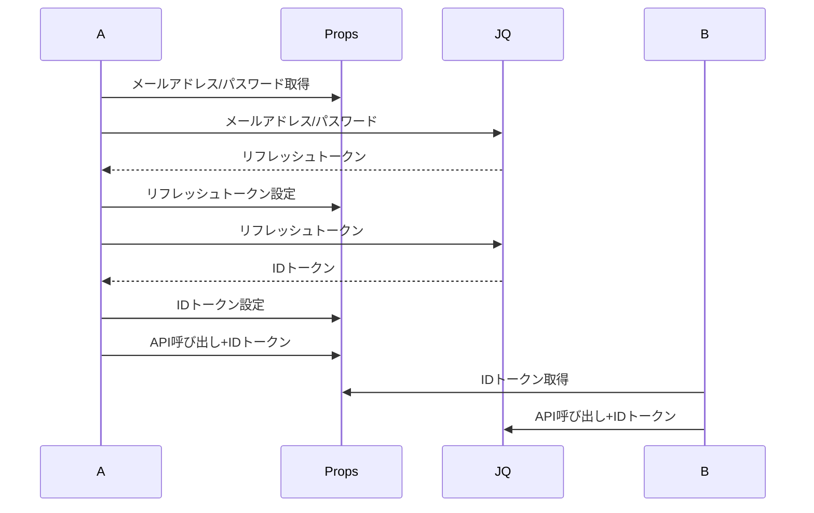
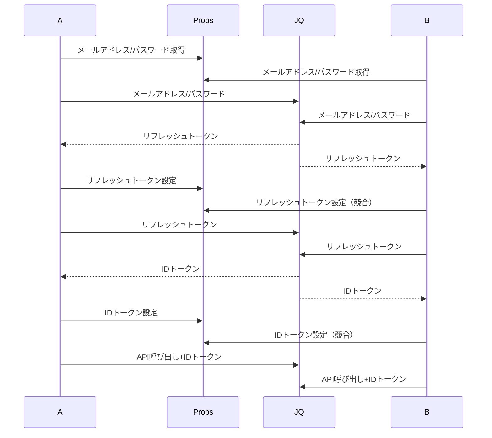
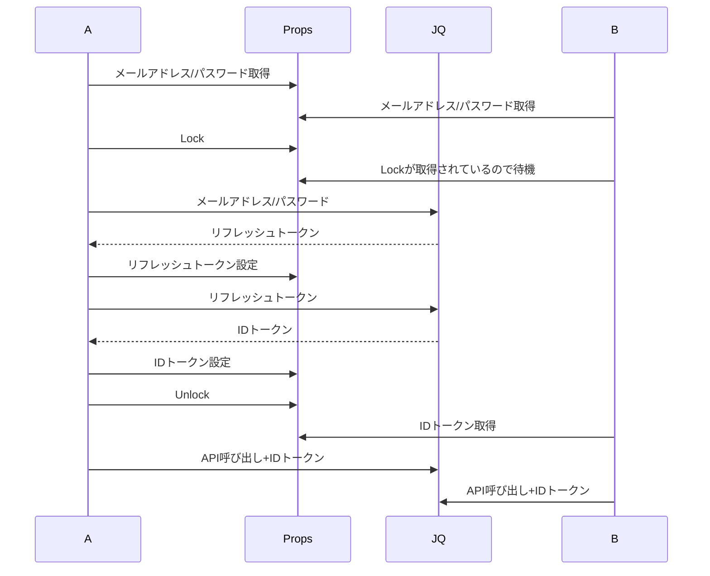
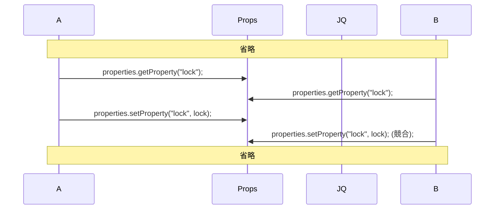
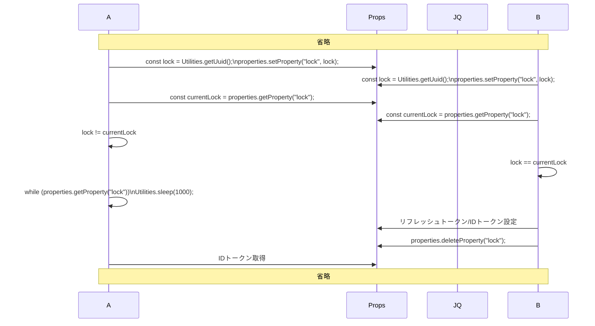
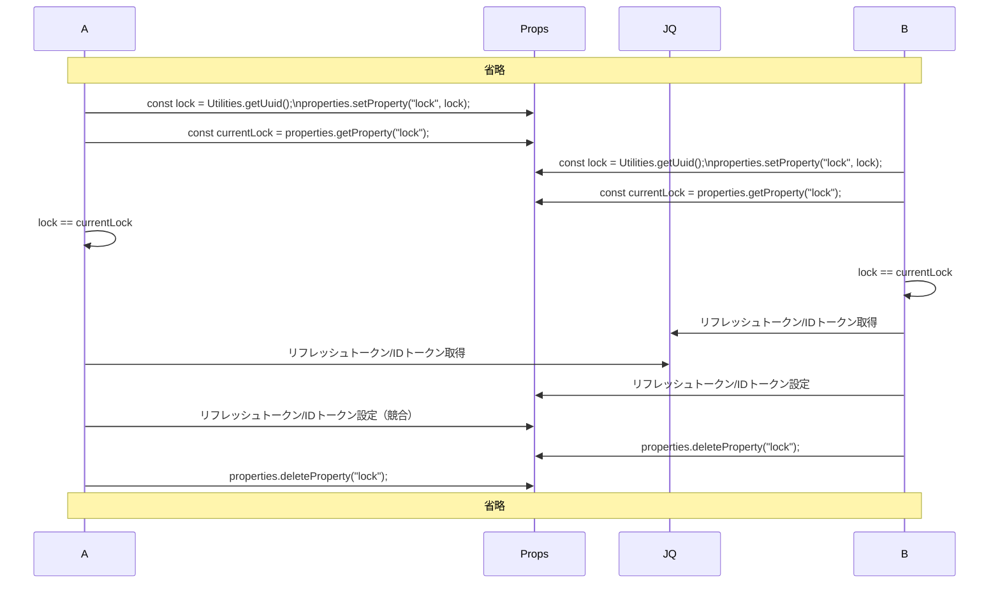
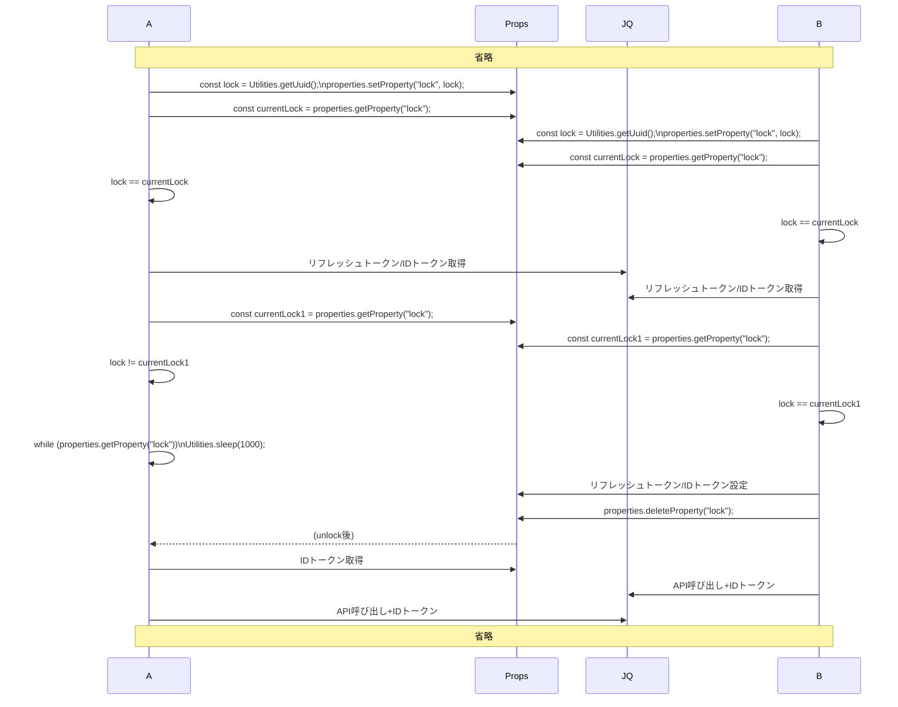

https://qiita.com/kijuky/items/465dca1775c511c226f5

---

> **Note:**  
> この記事はポエムです。実際にロック実装を行う場合は LockService を使ってください。
>
> https://qiita.com/kyamadahoge/items/f5d3fafb2eea97af42fe


Google Apps Script（GAS）を用いてWeb APIと連携する際、通常はアクセストークンを利用して通信が行われます。一部のAPIではアクセストークンの有効期限が設定されており、新しいアクセストークンを取得する必要があります。アクセストークンを都度取得することも可能ですが、既に取得済みのトークンを再利用することで余分なリクエストを抑えることができ、経済的です。これにより、異なるスレッドで同じトークンを共有することが求められます。GASではPropertiesを利用することで、簡単に共有リソースが実現できます。

本記事では、Propertiesを使ってトークンを共有する仕組みと、mutexの実装方法を紹介します。

# mutex

mutex とは相互排他(mutual exclusion)の略であり、特定の共有リソースを触るのは1スレッドのみに限定する概念です。例えば、トイレの個室などは mutex の例ですね。ある人がトイレを使用中であれば、別の人がそのトイレを使用したい場合は、トイレが空くまで待つ必要があります[^1]。


https://www.irasutoya.com/2018/07/blog-post_55.html



mutex とは、この例で言うところのトイレの使用ルールを表す概念のようなものです。

# 前提

今回は[J-Quants API](https://jpx.gitbook.io/j-quants-ja/outline/getstarted)を例に話を進めます。こちらのAPIは、有効なAPIを叩くためにIDトークンが必要で、IDトークンを発行するにはリフレッシュトークンが必要になります。リフレッシュトークンは自身のメールアドレス/パスワードが必要になります。



今回、Googleスプレッドシートの関数を使ってこのAPIを呼び出す方法を検討します。スプレッドシートでは、複数のセルに関数が記述されていると、並列計算が行われるため、APIの呼び出しも同時に行われます。リフレッシュトークンやIDトークンは有効期限内で共有できるので、複数のAPI呼び出し間で共有することが望ましいです。そのため、これらのトークンはPropertiesに保存しておくことが効果的です。



上記はうまくいっているパターンです。ただし実際はスプレッドシートの計算により、AとBがほぼ同時にリクエストすることが多く、ロックが機能せずに無駄なリクエストが発生してしまいます。



そこで、PropertiesとA、Bに対してmutexを適用し、この状況を解決していきたいと思います。

# Propertiesを使ったmutex実装

今回はPropertiesにLockをキーとしたPropertyを用意します。このキーがある場合は誰かがリフレッシュトークン/IDトークンを更新している最中なので、更新し終えるまで待機する、と言う仕組みです。このLockキーはちょうどトイレのドアの鍵の役割を果たします。



素朴に実装するとこんな感じでしょうか。

```javascript:code.gs
function myFunction() {
  const properties = PropertiesService.getScriptProperties();
  const lock = properties.getProperty("lock");
  if (lock) {
    while (properties.getProperty("lock")) {
      Utilities.sleep(1000);
    }
    const idToken = properties.getProperty("idToken");
    //...API呼び出し
    return;
  } else {
    properties.setProperty("lock", Utilities.getUuid());
  }
  // ...リフレッシュトークン取得
  properties.setProperty("refreshToken", refreshToken);
  // ...IDトークン取得
  properties.setProperty("idToken", idToken);
  properties.deleteProperty("lock");
  // ...API呼び出し
}
```

しかしこの実装の場合、AとBが同時にlockを取得した場合にはやはり問題があります。



Aがロックを設定する前にBがロックを確認してしまったので、Bはまだロックが取得されていないと思ってロックを取得してしまいます。そこで、設定した後にさらに値を取得してそれが自分が設定した値だったら、自分が真のロック取得者とします。

```javascript:code.gs
function myFunction() {
  const properties = PropertiesService.getScriptProperties();
  const lock = properties.getProperty("lock");
  if (lock) {
    while (properties.getProperty("lock")) {
      Utilities.sleep(1000);
    }
    const idToken = properties.getProperty("idToken");
    //...API呼び出し
    return;
  } else {
    const lock = Utilities.getUuid();
    properties.setProperty("lock", lock);
    const currentLock = properties.getProperty("lock");
    if (lock != currentLock) {
      while (properties.getProperty("lock")) {
        Utilities.sleep(1000);
      }
      const idToken = properties.getProperty("idToken");
      // ...API呼び出し
    }
  }
  // ...リフレッシュトークン取得
  properties.setProperty("refreshToken", refreshToken);
  // ...IDトークン取得
  properties.setProperty("idToken", idToken);
  properties.deleteProperty("lock");
  // ...API呼び出し
}
```



ちなみにこの実装はコンペア・アンド・スワップ(CAS)として知られています。[^2]

https://ja.wikipedia.org/wiki/%E3%82%B3%E3%83%B3%E3%83%9A%E3%82%A2%E3%83%BB%E3%82%A2%E3%83%B3%E3%83%89%E3%83%BB%E3%82%B9%E3%83%AF%E3%83%83%E3%83%97

ところで、次のような状況を考えてみましょう。この場合はAとBが双方ともロックを取ったと勘違いして処理をしてしまいます。特に、Bのロックの最中にAが更新をかけてしまうため、かなり危険です。



これを解決するために、リフレッシュトークンを設定するタイミングで、現在のロックが自分のものなのかを確認します。

```javascript:code.gs
function myFunction() {
  const lock = Utilities.getUuid();
  const properties = PropertiesService.getScriptProperties();
  const currentLock = properties.getProperty("lock");
  if (currentLock) {
    while (properties.getProperty("lock")) {
      Utilities.sleep(1000);
    }
    const idToken = properties.getProperty("idToken");
    //...API呼び出し
    return;
  } else {
    properties.setProperty("lock", lock);
    const currentLock = properties.getProperty("lock");
    if (lock != currentLock) {
      while (properties.getProperty("lock")) {
        Utilities.sleep(1000);
      }
      const idToken = properties.getProperty("idToken");
      // ...API呼び出し
    }
  }
  // ...リフレッシュトークン取得
  // ...IDトークン取得
  const currentLock1 = properties.getProperty("lock");
  if (lock != currentLock1) {
    while (properties.getProperty("lock")) {
      Utilities.sleep(1000);
    }
    const idToken = properties.getProperty("idToken");
    //...API呼び出し
  } else {
    properties.setProperty("refreshToken", refreshToken);
    properties.setProperty("idToken", idToken);
    properties.deleteProperty("lock");
    // ...API呼び出し
  }
}
```



さて、コードはごちゃごちゃしてきているので、いくつか重複した部分はまとめると良さそうですね。

# まとめ

GASで複数スレッドがアクセストークンを共有する実装として、Propertiesを用いたmutex実装を紹介しました。久しぶりに並列処理を設計したのでちょっとまとめておきたかったのと、GASで並列処理詳しい人に素人質問してもらいたくて書いてみました。参考になれば幸いです。実装が微妙で気になった方はコメントでツッコミいただけると助かります。

[^1]: トイレの個室を1人で使うことを想定しています。
[^2]: CASは正確には「自身の値を確実に設定する方法」なので、ここではちょっと用途が違うと思う。。。
