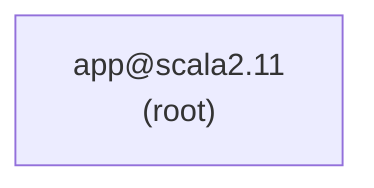
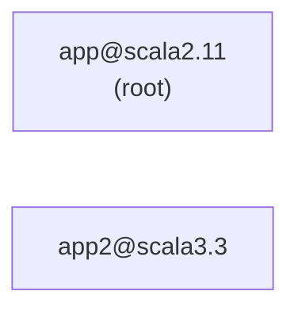
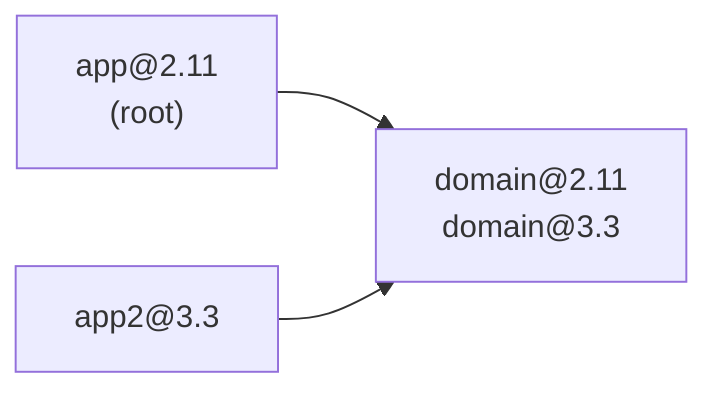

https://qiita.com/kijuky/items/9c0d53b3380275bc8429

---

sbtは、異なるScalaバージョンであってもクロスビルドの設定により、一度にビルドできます。ただ、シチュエーションによっては難しいようです。

# 背景

最初にアプリが1つありました。古くから運用されているプロジェクトで、そうですね...とにかく古いScalaを使っていて、仮にバージョンを2.11としましょうか。



流石に令和になって5年ほど経ったので、そろそろScalaのバージョンもあげたくなってきました。最近はScalaにもLTSの概念が導入されたので、LTSである3.3のバージョンを作りました。



appは規模がでかいので、一気にapp2にはせずに、少しずつ機能を移していこうと思います。切り出す機能はドメインオブジェクトを使っていたので、appとapp2の両方で使えるように、共通コード置き場を用意しました。ここに、ドメインオブジェクトがどんどん増えていく予定です。



# 設定ファイル

```properties:project/build.properties
sbt.version=1.9.9
```

```scala:build.sbt
ThisBuild / version := "0.1.0-SNAPSHOT"

ThisBuild / scalaVersion := "2.11.12"

lazy val domain = project
  .settings(
    crossScalaVersions := Seq("2.11.12", "3.3.3")
  )

lazy val root = (project in file("."))
  .dependsOn(domain)
  .settings(
    scalaVersion := "2.11.12"
  )

lazy val app2 = project
  .dependsOn(domain)
  .settings(
    scalaVersion := "3.3.3"
  )
```

これをビルドする場合、クロスビルドが必須になります。

```shell
sbt +compile
```

```shell
sbt +app2/compile
```

どういうことかというと、`ThisBuild/scalaVersion`が2.11.12なので、Scala3.3.3が存在しないものとされ、`sbt compile`だと`domain`のScala3.3.3バージョンが存在せず失敗してしまいます。

# IntelliJ IDEAの場合

IntelliJ IDEAはsbtのプロジェクトを認識してプロジェクト構成をセットアップしてくれるのですが、それがうまくいきません。以下の魔法を唱えると、うまくいきます。

```shell
sbt +updateClassifiers +app2/updateClassifiers
```

`sbt clean`しても消えませんが、消えてしまうこともあるので、`clean`コマンドをこの2つも呼び出すようにオーバーライドしてしまっても良いかもしれません。

# まとめ

これらは動く組み合わせを探したらこれだったというログで、論理立ててこの設定が良い、というものではありません。もしこの辺の上手い設定や運用方法があれば、コメントお願いします :pray: 
