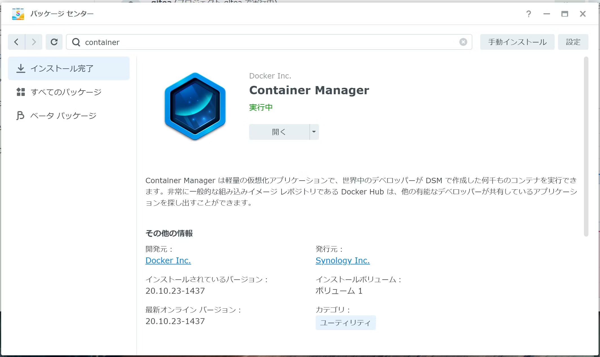
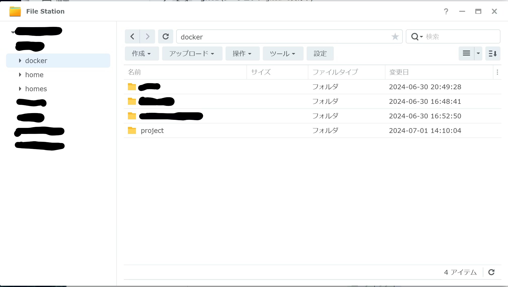
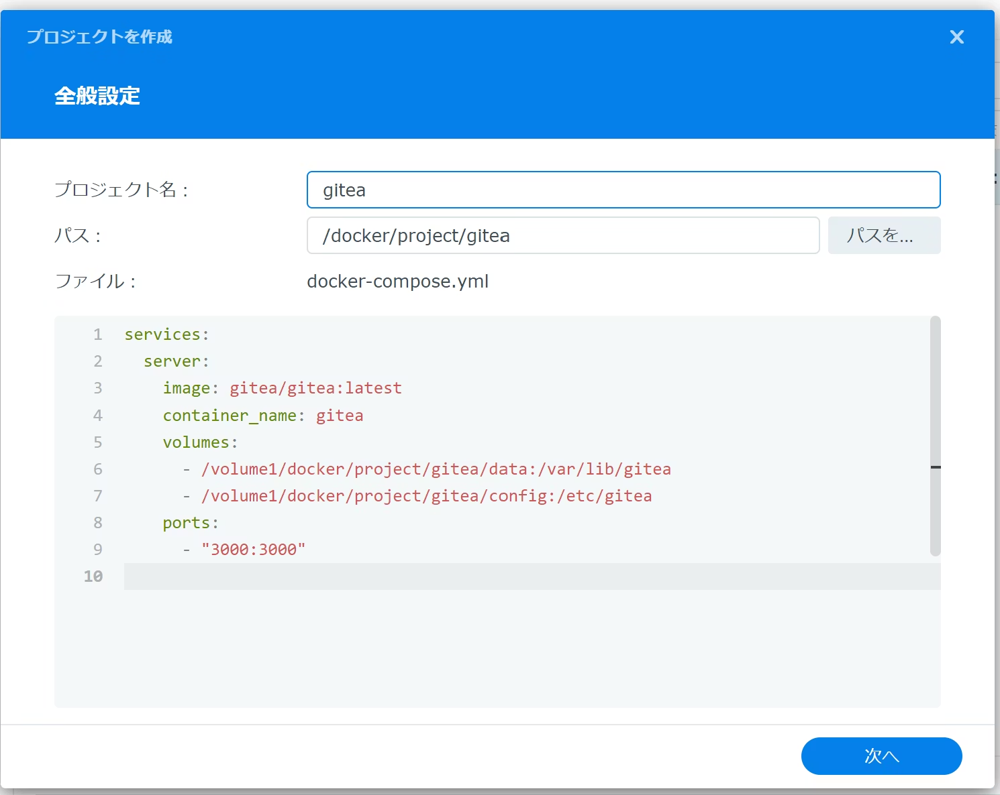
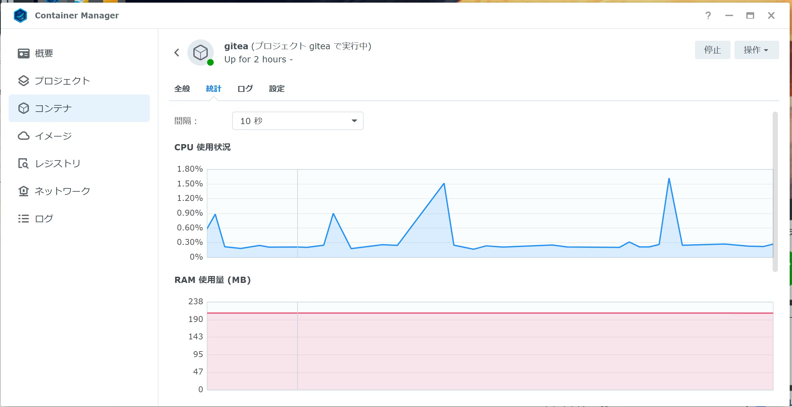

https://qiita.com/kijuky/items/0257a0b599dac9ba3197

---

私は家でSynologyを飼っているんですけど、プライベートのgitリポジトリも管理したいと思いました。CI/CD機能も欲しいので、Synologyで実行できるgitクライアントを探してみました。

最初は会社でも使っているGitLabを立ち上げようと思ったのですが、どうやっても[`gitlab.socket`の問題](https://qiita.com/rsasns/items/92a14879e4f59fb9499c)が解決できないし、CPU/メモリの使用量が多すぎてSynology管理画面がめちゃくちゃ不安定になりました。

GitLabは難しそうなので、ChatGPTに代替を聞いたら「giteaがいいよ」と返ってきました。giteaはgo製のアプリらしいです。初手の`docker-compose.yml`も難しそうな記述がなさそうで、さっそくトライしてみました。

https://about.gitea.com/

# Container Managerをつかったgiteaの立ち上げ

まずはSynologyのパッケージセンターでContainer Managerをインストールしておきます。



Container Managerをインストールすると`docker`共有フォルダが作成されます。



`project/gitea`フォルダを作成し、`docker-compose.yml`を作成します。管理者なら`docker`共有フォルダをマウントできるので、そちらで作業するとよいです。

```docker-compose.yml
services:
  server:
    image: gitea/gitea:latest
    container_name: gitea
    environment:
      - USER_UID=1000
      - USER_GID=1000
    volumes:
      - ./data:/data
    ports:
      - "8888:3000" # 外側からは http://<NASのIPアドレス>:8888 で接続する
      - "2222:22"   # 外側からは ssh://git@<NASのIPアドレス>:2222/group/repo で接続する
```

https://docs.gitea.com/installation/install-with-docker

- うまくやれば`rootless`でできるんだろうけど(`rootless`のほうが安全)、`rootless`だとフォルダの書き込み権限を取れずに起動に失敗する。
- `volumes`が指すフォルダ(`data`)は先に作っておく。
- ホストとtimezoneを同期するのは難しいらしいので、無理に設定しなくてもよい。
    - https://www.reddit.com/r/synology/comments/pd4qy3/how_to_map_synology_host_timezone_etctz_to_docker/?rdt=33420
    - https://community.synology.com/enu/forum/17/post/110130
- HTTPに関するポート(3000)を変更する場合、外側だけ修正する（起動時に自動設定される）。
- SSHに関するポート(22)を変更する場合、giteaを起動したらそのポートを設定する（起動時に自動設定されない）

Container Managerの`プロジェクト`から`作成`ボタンを押下し、作成した`docker-compose.yml`を設定する。




`構築`を押すとコンテナが作成され、起動する。もし起動しない場合は`開始`を押下する。

その後 `http://<NASのIPアドレス>:3000` にアクセスすると、giteaの初回画面が表示される。日本語にローカライズされているので、それもうれしい。

起動し続けていても、CPU/メモリ使用率はこんなもんなので、ホストにも優しい。



# おわりに

とりあえず構築メモです。CI/CDがGitHub互換という話も聞いており、GitHubのプロジェクトを管理するのも便利そうです。
