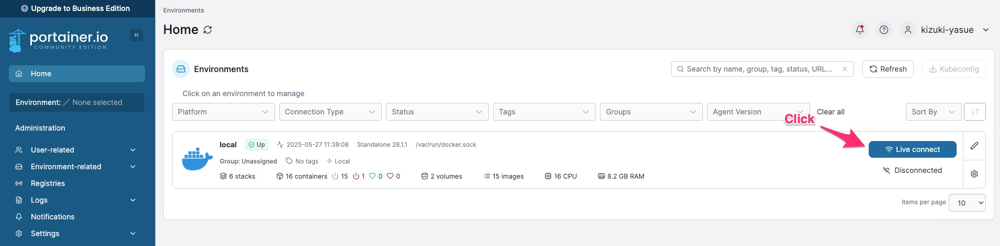
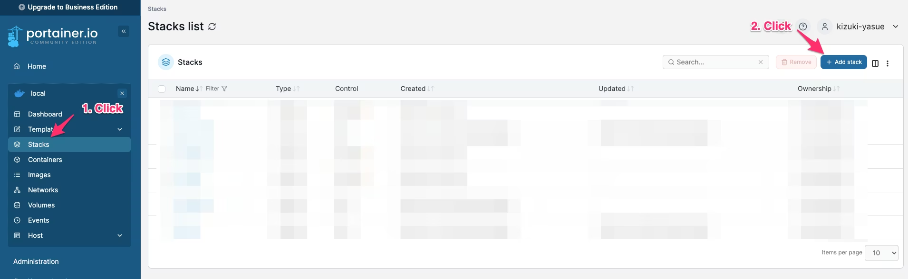
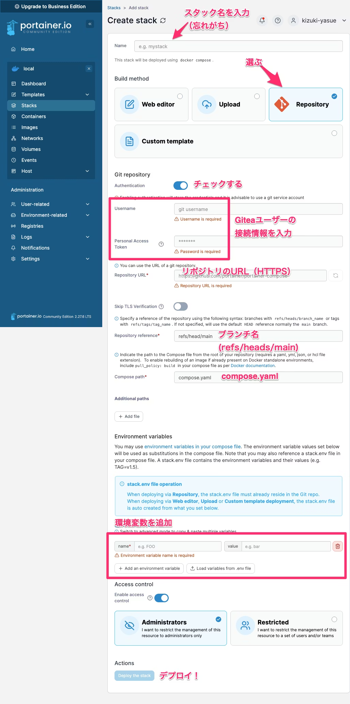
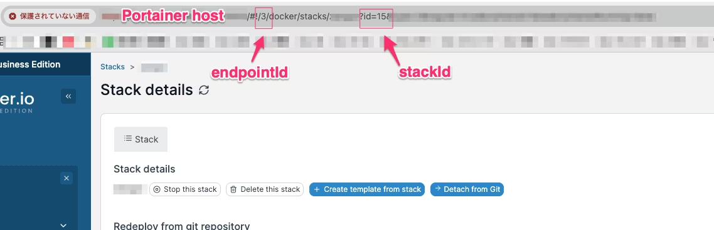

https://qiita.com/kijuky/items/7f1fc94a19bf6f449c27


---

[botの作成](https://qiita.com/kijuky/items/b629f70776a91ef6a288)などを行っていると、開発からデプロイのサイクルを高速に回したくなってきますよね。この記事では、セルフホスト可能なGitea + Portainerを用いてプライベート開発でgit tagプッシュ時にdockerビルドしてサービスをデプロイできるようにします。

# はじめに

## Gitea

https://about.gitea.com/

GiteaはGitリポジトリのホストサービスです。Go製で動作が軽いです。

## Portainer

https://www.portainer.io/

Portainerはdockerデーモンをリモートで監視できるSaaSです。REST APIがあるので、今回はGitea ActionsでこのREST APIを叩くのが基本戦略です。

# tag デプロイ環境を構築する

## 1. Gitea Runner を用意する。

GiteaにはRunner機能が内包されているので、それを使います。ホストのcompose.yamlに一緒に入れて良いです。ただし、ホスト側の起動前にRunnerが起動してしまうとRunnerが落ちてしまうので、ホストが起動するまで待ちます。

> **Note:**  
> 私の環境だけかもしれませんが、Runnerは起動し続けているといつの間にか接続が切れてしまっていることがあります。そういう時はRunnerを再起動します。

```compose.yaml
services:
  server:
    image: gitea/gitea:latest
    container_name: gitea
    environment:
      - USER_UID=1000
      - USER_GID=1000
    volumes:
      - ./server/data:/data
    ports:
      - "3000:3000"
      - "22:22"
  runner:
    image: gitea/act_runner:latest
    container_name: gitea-runner
    restart: unless-stopped
    depends_on:
      - server
    environment:
      GITEA_INSTANCE_URL: "http://server:3000/"
      GITEA_RUNNER_REGISTRATION_TOKEN: "${GITEA_RUNNER_REGISTRATION_TOKEN}"
      GITEA_RUNNER_NAME: "${GITEA_RUNNER_NAME}"
    volumes:
      - ./runner/data:/data
      - /var/run/docker.sock:/var/run/docker.sock
    command: |
      "until curl -sf http://server:3000; do echo 'Waiting for Gitea...'; sleep 2; done;
       /sbin/tini -- /usr/local/bin/act_runner"
```

`GITEA_RUNNER_REGISTRATION_TOKEN` はホストでランナー登録画面で確認できます。`GITEA_RUNNER_NAME` はランナーを識別するための適当な名前です。

ここで、個人開発プロジェクトをgit化し、Giteaにプッシュしておきます。

## 2. Portainer で Stack を作る。

こんな感じで Portainer CE (無料版)を立ち上げておきます。

```compose.yaml
services:
  portainer:
    image: portainer/portainer-ce:latest
    container_name: portainer
    restart: always
    ports:
      - "8000:8000"
      - "9443:9443"
    volumes:
      - /var/run/docker.sock:/var/run/docker.sock
      - ./data:/data
```

`http://localhost:8000` にアクセスし、ローカルのDockerデーモンにLive接続します。



新規Stackを作成します。



Giteaリポジトリに関連づけたStackを作成します。このタイミングでデプロイ可能なものを用意しておく必要があります。

> **Note:**  
> ボリュームマウントのパスに `.` や `~` などを使うことができません。Portainerのホストの絶対パスを記述する必要があります。compose.yaml上では`{$VOLUME_ROOT:-.}`みたいにして、下記環境変数で `VOLUME_ROOT` に絶対パスを記述しましょう。



デプロイが完了するとスタックのダッシュボードが見れます。この画面のURLを控えておきます。



## 3. Gitea Actions を書く。

Gitea Actions は GitHub Actions のローカル版である[act](https://github.com/nektos/act)の[フォーク](https://gitea.com/gitea/act_runner)です。そのため、yamlに互換性があります。

リポジトリに下記のyamlを用意します。

> **Note:**  
> Stackを作った時に設定した環境変数を再び設定する必要があります。

```.gitea/workflows/deploy.yml
name: Redeploy Portainer Stack

on:
  push:
    tags:
      - 'v*'

jobs:
  redeploy:
    runs-on: ubuntu-latest

    steps:
      - name: Call Portainer API to Redeploy stack
        env:
          PORTAINER_URL: ${{ secrets.PORTAINER_URL }}
          PORTAINER_USERNAME: ${{ secrets.PORTAINER_USERNAME }}
          PORTAINER_PASSWORD: ${{ secrets.PORTAINER_PASSWORD }}
          PORTAINER_STACK_ID: ${{ secrets.PORTAINER_STACK_ID }}
          PORTAINER_ENDPOINT_ID: ${{ secrets.PORTAINER_ENDPOINT_ID }}
          # ...その他アプリで必要な環境変数を全部書く
          ENV1: ${{ secrets.ENV1 }}
          ENV2: ${{ secrets.ENV2 }}
        run: |
          # Get JWT
          TOKEN=$(curl --insecure -s -X POST "${PORTAINER_URL}/api/auth" \
            -H "Content-Type: application/json" \
            -d "{\"Username\":\"${PORTAINER_USERNAME}\",\"Password\":\"${PORTAINER_PASSWORD}\"}" \
            | jq -r '.jwt')

          if [ "$TOKEN" == "null" ]; then
            echo "Failed to get JWT token"
            exit 1
          fi

          # Redeploy stack
          curl --insecure -s -X PUT "${PORTAINER_URL}/api/stacks/${PORTAINER_STACK_ID}/git/redeploy?endpointId=${PORTAINER_ENDPOINT_ID}" \
            -H "Authorization: Bearer ${TOKEN}" \
            -H "Content-Type: application/json" \
            -d "{\"PullImage\":true,\"prune\":true,\"RepositoryAuthentication\":true,\"env\":[
                {\"name\":\"ENV1\",\"value\":\"${ENV1}\"},
                {\"name\":\"ENV2\",\"value\":\"${ENV2}\"}]}"
```

CI環境変数（ここではシークレット）をGitea Runnerのシークレットに設定します。`PORTAINER_STACK_ID`以外は共通なので、このPortainerで管理するサービスは同じ組織に所属させておくと便利でしょう。

https://docs.gitea.com/usage/actions/secrets

それでは、これをコミットし、コミットに `v*` なタグを設定してプッシュしましょう。すると Gitea RunnerがActionsを実行し、Portainer StackがRedeployされます。

# まとめ

Gitea + Portainerを使ってCD環境を構築しました。これでtagを打つだけでデプロイできるようになりました。やったね！
