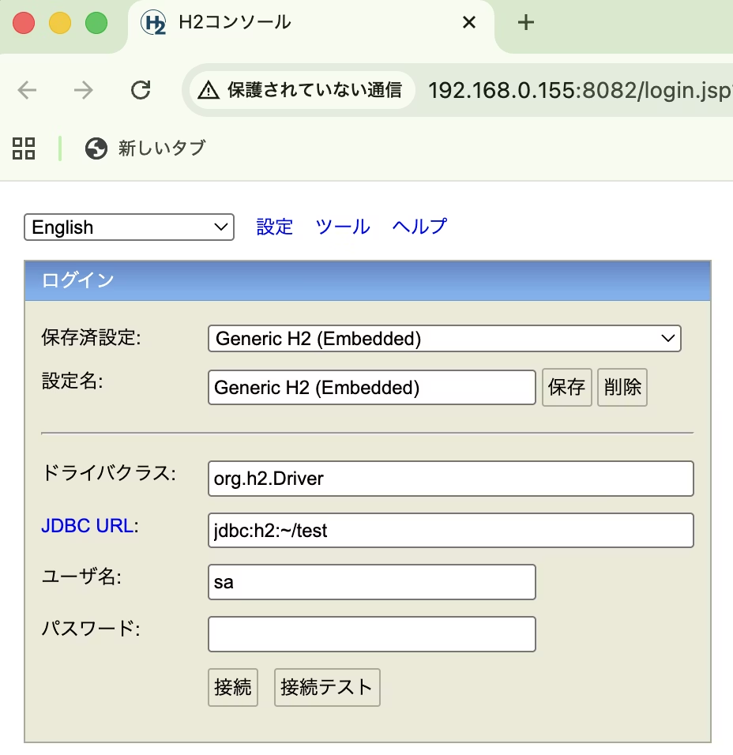

https://qiita.com/kijuky/items/e23d6cb2ac764696eb23

---

```scala:h2.sc
//> using dep "com.h2database:h2:2.4.240"

org.h2.tools.Console.main()
```

```console
scala-cli h2.sc
```

ブラウザが開き、h2のDBViewerが開く



# 参考文献

https://javadoc.io/static/com.h2database/h2/2.4.240/org/h2/tools/Console.html#main(java.lang.String...)
